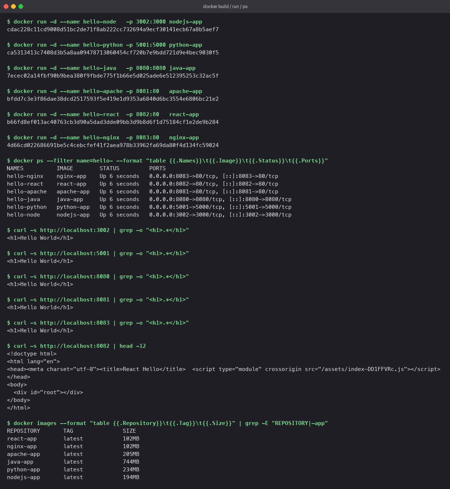
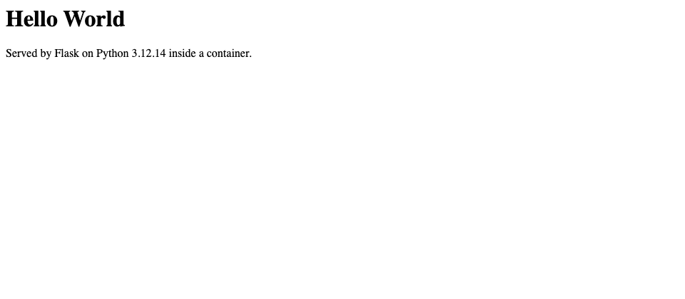
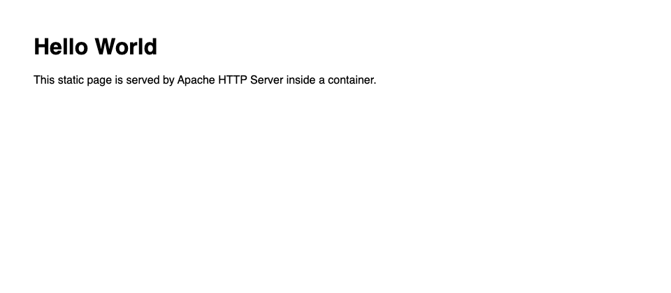
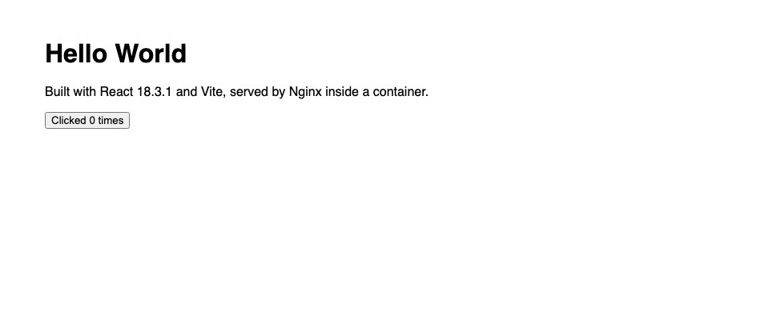

# Docker Fundamentals

## At a glance

The same "Hello World" page served by six different runtimes, each from its own Dockerfile:
Node.js, Python with Flask, Java, Apache httpd, React built with Vite, and Nginx. Building
them side by side makes the Dockerfile patterns obvious: a base image, a working directory, a
copy of the source, an optional build step, an exposed port, and a start command.

A `compose.yaml` runs all six at once.

## Concepts

### Anatomy of a Dockerfile

```dockerfile
FROM    <base image>        # where to start: OS + runtime already installed
WORKDIR <dir>               # cd into this directory for the rest of the file
COPY    <src> <dest>        # bring files from the build context into the image
RUN     <command>           # execute at build time (install, compile)
EXPOSE  <port>              # documentation: which port the process listens on
CMD     ["binary", "arg"]   # what to run when the container starts
```

Every instruction that changes the filesystem creates a **layer**. Layers are cached, so the
order matters: put things that change rarely (dependency installs) *before* things that change
often (your source code).

### Image, container, port mapping

```
Dockerfile ──docker build──► image ──docker run──► container
                             (read-only template)  (running process + writable layer)

-p 8081:80
    │    └── port the process listens on INSIDE the container
    └─────── port on YOUR machine that forwards to it
```

### The six apps compared

| App | Base image | Build step | Serves | Size |
|---|---|---|---|---|
| `nodejs-app` | `node:20-alpine` | none | Node `http` module | 194 MB |
| `python-app` | `python:3.12-slim` | `pip install flask` | Flask | 234 MB |
| `java-app` | `eclipse-temurin:21-jdk` | `javac Main.java` | JDK `HttpServer` | 744 MB |
| `Apache-app` | `httpd:2.4` | none | static file | 205 MB |
| `React-app` | `node:20-alpine` then `nginx:alpine` | `vite build` | static bundle via Nginx | 102 MB |
| `nginx-app` | `nginx:alpine` | none | static file | 102 MB |

Two things stand out. The Java image is seven times the Nginx image because it carries a whole
JDK; a JRE base or `jlink` would shrink it. The React image is the *same size* as plain Nginx,
because the Node toolchain used to build it lives in a first stage that is thrown away. That
pattern is the subject of the next lab.

## Ports

Each container listens on its natural port. Host ports were chosen to dodge common collisions
on macOS: 5000 is taken by AirPlay Receiver and 3000/3001 by local dev servers.

| App | Container port | Host port | URL |
|---|---|---|---|
| Node.js | 3000 | 3002 | http://localhost:3002 |
| Python / Flask | 5000 | 5001 | http://localhost:5001 |
| Java | 8080 | 8080 | http://localhost:8080 |
| Apache | 80 | 8081 | http://localhost:8081 |
| React | 80 | 8082 | http://localhost:8082 |
| Nginx | 80 | 8083 | http://localhost:8083 |

## Lab

### Option A: one command with Compose

```bash
cd "Docker Fundamentals"
docker compose up -d --build     # build all six images, start all six containers
docker compose ps                # names, status, port mappings
docker compose logs node         # logs from one service
docker compose down              # stop and remove everything
```

### Option B: by hand, one image at a time

Doing it manually once is worth it to see what Compose is doing for you.

```bash
cd "Docker Fundamentals"

docker build -t nodejs-app ./nodejs-app
docker build -t python-app ./python-app
docker build -t java-app   ./java-app
docker build -t apache-app ./Apache-app
docker build -t react-app  ./React-app
docker build -t nginx-app  ./nginx-app

docker run -d --name hello-node   -p 3002:3000 nodejs-app
docker run -d --name hello-python -p 5001:5000 python-app
docker run -d --name hello-java   -p 8080:8080 java-app
docker run -d --name hello-apache -p 8081:80   apache-app
docker run -d --name hello-react  -p 8082:80   react-app
docker run -d --name hello-nginx  -p 8083:80   nginx-app

docker ps --filter name=hello-
docker images --format "table {{.Repository}}\t{{.Size}}" | grep -E "app|REPO"
```

### Verify

```bash
for p in 3002 5001 8080 8081 8082 8083; do
  printf '%s -> ' "$p"; curl -s "http://localhost:$p" | grep -o "<h1>.*</h1>" || echo "(no h1 in body)"
done
```

Five of the six return `<h1>Hello World</h1>` directly. The React app returns an HTML shell
with a `<script type="module">` tag; its heading is rendered by JavaScript in the browser, so
for that one the browser screenshot is the real check.

### Tear down (manual route)

```bash
docker rm -f hello-node hello-python hello-java hello-apache hello-react hello-nginx
```

## Walkthrough of each Dockerfile

**nodejs-app**: `node:20-alpine`, copies `package.json` and `app.js`, runs `node app.js`.
There is no `npm install` because the `http` module ships with Node. The port comes from an
`ENV PORT=3000` so it can be overridden at run time with `-e PORT=...`. A `.dockerignore`
keeps `node_modules` out of the build context.

**python-app**: `python:3.12-slim`. `requirements.txt` is copied and installed *before*
`app.py`, so editing the app does not invalidate the pip layer. Flask binds to `0.0.0.0`;
binding to `127.0.0.1` would make it unreachable through the port mapping.

**java-app**: `eclipse-temurin:21-jdk`. `javac Main.java` runs at build time so the image
holds compiled classes. The server is `com.sun.net.httpserver`, part of the JDK, so there is
no Maven or Gradle.

**Apache-app**: `httpd:2.4` with a single `COPY` into `/usr/local/apache2/htdocs/`.

**React-app**: two stages. Stage 1 (`node:20-alpine`) runs `npm install` and `vite build`.
Stage 2 (`nginx:alpine`) copies only the `dist/` folder. The final image never contains Node.

**nginx-app**: `nginx:alpine` with a single `COPY` into `/usr/share/nginx/html/`.

## What you should see

Build output, `docker ps`, `curl` checks, and image sizes:



Each app in the browser:

| | |
|---|---|
| Node.js  | Python  |
| Java  | Apache  |
| React  | Nginx  |

## Pitfalls

- **"Connection reset" or empty reply through `-p`.** The process inside is bound to
  `127.0.0.1`. Bind to `0.0.0.0`.
- **"port is already allocated".** Something on the host owns that port. `lsof -i :5000` on
  macOS, `ss -tulpn` on Linux. Pick another host port; the container port stays the same.
- **Slow rebuilds.** Source files are copied before dependencies are installed, so every edit
  re-runs the install. Reorder: dependency manifest, install, then source.
- **Huge build context.** `node_modules` or `.git` being sent to the daemon. Add a
  `.dockerignore`.
- **`EXPOSE` does not publish.** It is documentation. Only `-p` (or `ports:` in Compose)
  makes a port reachable from the host.

## Check yourself

1. Why does the React image end up the same size as the plain Nginx image?
2. What would happen to build times if `COPY app.py .` came before `RUN pip install` in the Python Dockerfile?
3. What is the difference between `EXPOSE 80` in a Dockerfile and `-p 8081:80` at run time?
4. The Java image is 744 MB. Name two ways to cut that down.
5. Why does `curl localhost:8082` not show "Hello World" for the React app when the browser does?
