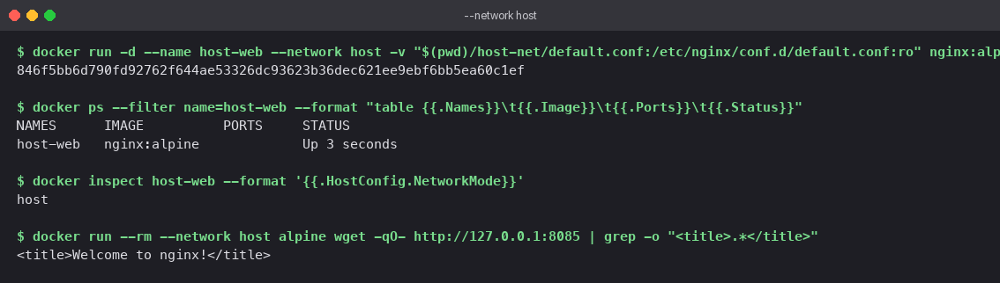
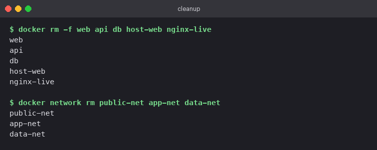

# Docker Networks and Volumes

## At a glance

Four exercises on how containers talk to each other and to the host. First, three containers
on three user-defined bridge networks, arranged so the middle tier can reach both neighbours
while the outer tiers cannot see each other. Second, a container on the host's network stack.
Third, a bind mount that makes a host directory live inside a container. Fourth, a reading
section on overlay networks, which do for a cluster what bridges do for one machine.

A `compose.yaml` reproduces the first exercise in one command.

## Concepts

### Network drivers

| Driver | Scope | What it gives a container | Typical use |
|---|---|---|---|
| `bridge` (default) | One host | Its own network namespace on a private subnet, NAT to the outside | Default for `docker run` |
| user-defined `bridge` | One host | Same, plus **DNS by container name** and isolation from other bridges | Almost everything on a single host |
| `host` | One host | No namespace; shares the host's interfaces and ports directly | Performance-sensitive or port-heavy services |
| `none` | One host | Loopback only | Batch jobs that must not talk to anything |
| `overlay` | Many hosts | A virtual LAN across machines via VXLAN | Swarm or Kubernetes clusters |

The default `bridge` network does **not** provide name resolution between containers. Create
your own network and you get an embedded DNS server for free. That is the single most useful
thing to know about Docker networking.

### Isolation by membership

A container can only resolve and reach containers on networks it shares. Two containers with no
network in common cannot even look each other up. This is stronger than a firewall rule: from
the isolated container's point of view, the other one does not exist.

```
             public-net                app-net                 data-net
  ┌─────┐  ──────────────  ┌─────┐  ──────────────  ┌─────┐
  │ web │ ◄──────────────► │ api │ ◄──────────────► │ db  │
  └─────┘                  └─────┘                  └─────┘
     └────────────── ✗ no shared network ──────────────┘
```

### Volumes vs bind mounts

| | Bind mount | Named volume |
|---|---|---|
| Where the data lives | A path you choose on the host | Docker-managed directory |
| Syntax | `-v /host/path:/container/path` | `-v myvol:/container/path` |
| Good for | Live editing during development, config files | Databases, anything that must survive `docker rm` |
| Portable across hosts | No, the path must exist | Yes |

## Lab

### 1. Three containers, three networks

| Container | Image | Networks |
|---|---|---|
| `web` | `nginx:alpine` | `public-net` |
| `api` | `nginx:alpine` | `app-net`, `public-net`, `data-net` |
| `db` | `postgres:16-alpine` | `data-net` |

**With Compose:**

```bash
cd "Docker Networks"
docker compose up -d
```

**By hand:**

```bash
docker network create public-net
docker network create app-net
docker network create data-net

docker run -d --name web --network public-net nginx:alpine
docker run -d --name api --network app-net    nginx:alpine
docker run -d --name db  --network data-net   -e POSTGRES_PASSWORD=secret postgres:16-alpine

# a running container can be attached to more networks
docker network connect public-net api
docker network connect data-net   api

docker inspect api --format '{{range $k,$v := .NetworkSettings.Networks}}{{$k}} {{end}}'
# app-net data-net public-net
```

**Connectivity checks,** using tools already in the images (`wget` and `nc` from BusyBox):

```bash
docker exec api wget -qO- http://web | grep -o "<title>.*</title>"   # works: share public-net
docker exec api nc -z -w 3 db 5432 && echo "api -> db ok"           # works: share data-net
docker exec web wget -qO- http://api | grep -o "<title>.*</title>"   # works: share public-net
docker exec web nc -z -w 3 db 5432                                   # nc: bad address 'db'
```

**What you should see**

- `api` reaches both `web` and `db` by name.
- `web` reaches `api` but cannot even resolve `db`. Not "connection refused"; the name does
  not exist from `web`'s side.
- `docker inspect api` shows three networks and three IP addresses, one per network.


### 2. Host network

Port 80 in the engine's VM was already in use, so this run serves on 8085 via a one-line
config in `host-net/default.conf`:

```nginx
server {
    listen 8085;
    location / {
        root  /usr/share/nginx/html;
        index index.html;
    }
}
```

```bash
docker run -d --name host-web --network host \
  -v "$(pwd)/host-net/default.conf:/etc/nginx/conf.d/default.conf:ro" nginx:alpine

docker ps --filter name=host-web                                  # PORTS column is empty
docker inspect host-web --format '{{.HostConfig.NetworkMode}}'   # host
```

With `--network host` the container has no network namespace of its own. `-p` is meaningless
and `docker ps` shows no port mappings, because Nginx is simply listening on the host's 8085.

**On Docker Desktop for macOS,** "the host" is the Linux VM, not the Mac. So `curl localhost:8085`
from the Mac fails. To prove the container is on the host network, run a second container on
the same network and fetch from `127.0.0.1`:

```bash
docker run --rm --network host alpine wget -qO- http://127.0.0.1:8085 | grep -o "<title>.*</title>"
# <title>Welcome to nginx!</title>
```

On a native Linux host, `curl http://localhost:8085` works directly.



### 3. Bind mount

```bash
docker run -d --name nginx-live -p 8090:80 \
  -v "$(pwd)/site:/usr/share/nginx/html:ro" nginx:alpine

curl -s http://localhost:8090 | grep "<p>"
#   <p>Version 1: this file lives on the host and is mounted into the container.</p>

# edit on the host while the container keeps running
sed -i '' 's/Version 1: .*container\./Version 2: edited on the host while the container kept running./' site/index.html

curl -s http://localhost:8090 | grep "<p>"
#   <p>Version 2: edited on the host while the container kept running.</p>

docker inspect nginx-live --format '{{range .Mounts}}{{.Type}} {{.Source}} -> {{.Destination}} ({{.Mode}}){{end}}'
# bind /.../Docker Networks/site -> /usr/share/nginx/html (ro)
```

No restart, no rebuild. The second `curl` returns the new text because both sides are the same
directory. `:ro` mounts it read-only inside the container, a sensible default for static files.
The `site/` folder with the final `index.html` is committed next to this README.


### 4. Overlay networks (reading)

Bridge networks exist on one Docker host. An **overlay network** spans several hosts so that
containers on different machines can address each other by name as if they shared a LAN.

How it works:

- Each host runs a VXLAN tunnel endpoint. Container traffic is wrapped in UDP packets on
  port 4789 and sent across the physical network to the host that owns the destination
  container, where it is unwrapped.
- Something has to hand out IPs and track which container is where. In Docker that is
  **Swarm mode**; Kubernetes uses CNI plugins such as Flannel, Calico, or Cilium.
- Add `--opt encrypted` when creating the network to encrypt traffic on the wire.

Minimal example:

```bash
docker swarm init
docker network create --driver overlay --attachable team-overlay
docker service create --name web --network team-overlay --replicas 3 nginx:alpine
```

| | Bridge | Overlay |
|---|---|---|
| Scope | One host | Many hosts |
| Needs an orchestrator | No | Yes (Swarm or Kubernetes) |
| Encapsulation | None, a Linux bridge | VXLAN over UDP 4789 |
| Use it for | Local development, single-server deployments | Services spread across a cluster |

## Cleanup

```bash
docker compose down                      # if you used Compose for section 1
docker rm -f web api db host-web nginx-live
docker network rm public-net app-net data-net
docker network prune                     # remove any other unused networks
```



## Pitfalls

- **"bad address" when pinging a container by name.** You are on the default `bridge`
  network, which has no DNS. Create a user-defined network.
- **`-p` ignored with `--network host`.** Expected. The container already has the host's
  ports.
- **Host network does nothing useful on Docker Desktop.** The host is the VM. Test from
  another container on the host network, or use Linux.
- **Bind mount shows an empty directory.** The host path is wrong or relative. Use an
  absolute path; `$(pwd)` helps.
- **Mounting over a directory the image already populated.** The mount hides the image's
  contents. This is what you want for `html/`, and what you do not want for `/usr/bin`.
- **Container-to-host calls.** From a bridge network use `host.docker.internal` (Desktop)
  or the bridge gateway IP (Linux), not `localhost`.

## Check yourself

1. Why can `web` reach `api` but not `db`, when all three are running on the same machine?
2. What does the embedded DNS server give you that the default `bridge` network does not?
3. When would you choose `--network host` over a `-p` mapping, and what do you give up?
4. Explain the difference between `-v ./site:/html` and `-v site:/html`.
5. What problem does an overlay network solve that a bridge network cannot?
