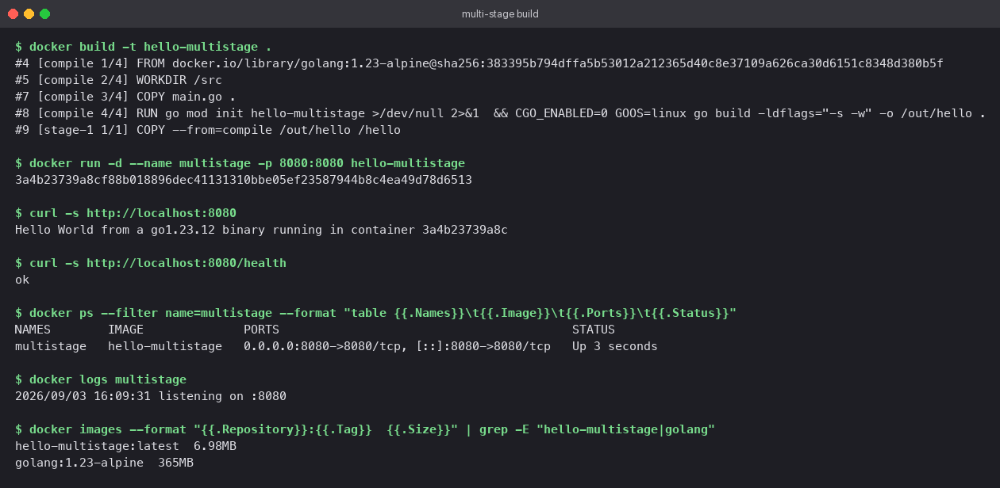
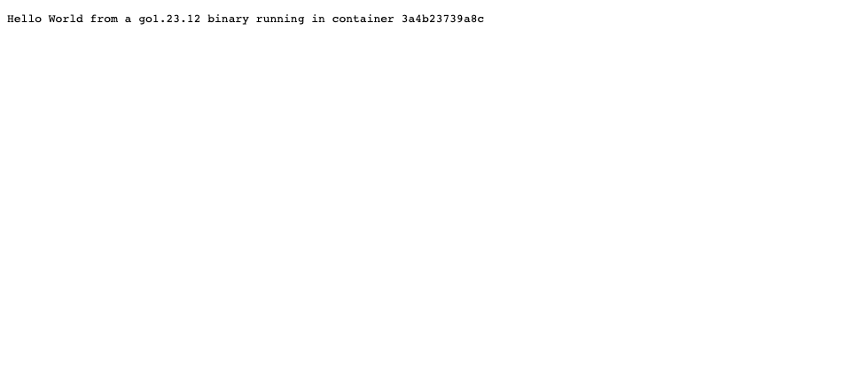

# Dockerfiles and Images

## At a glance

A compiled program needs a compiler to build but not to run. This lab builds a tiny Go web
server two ways: a naive single-stage Dockerfile that ships the whole toolchain, and a
multi-stage Dockerfile that ships only the binary. The result is a 365 MB image versus a 7 MB
one, for the same running program.

## Concepts

### What ends up in an image

Every `RUN`, `COPY`, and `ADD` adds a layer. Deleting a file in a later layer does not remove
it from the image; the earlier layer still holds it. So in a single-stage build the compiler,
the source, and the download cache are all shipped to production whether or not the last
instruction cleans up.

### Multi-stage builds

```dockerfile
FROM golang:1.23-alpine AS compile     # stage 1: has the toolchain
...                                     # build the binary here
FROM scratch                            # stage 2: an empty image
COPY --from=compile /out/hello /hello   # take ONLY the artefact across
```

The second `FROM` starts a fresh image. Nothing from the first stage is included unless you
`COPY --from` it. The first stage is still cached locally, so rebuilds stay fast, but it never
becomes part of the image you push.

### Choosing the runtime base

| Base | Size | Has a shell? | Use when |
|---|---|---|---|
| `scratch` | 0 B | No | Static binaries (Go, Rust with musl) |
| `gcr.io/distroless/static` | ~2 MB | No | Same, plus CA certificates and a non-root user |
| `alpine` | ~8 MB | Yes (`sh`) | You need a shell or `apk` at run time |
| `debian:slim` | ~75 MB | Yes | Dynamic binaries with glibc dependencies |

`scratch` is the smallest possible attack surface, but there is no shell for `docker exec`
and no CA bundle for outbound HTTPS. Know what your binary needs before choosing it.

## The application

`main.go` is an HTTP server on port 8080. `/` returns a greeting with the Go version and the
container's hostname; `/health` returns `ok`.

```go
package main

import (
	"fmt"
	"log"
	"net/http"
	"os"
	"runtime"
)

func main() {
	host, _ := os.Hostname()

	http.HandleFunc("/", func(w http.ResponseWriter, r *http.Request) {
		fmt.Fprintf(w, "Hello World from a %s binary running in container %s\n", runtime.Version(), host)
	})
	http.HandleFunc("/health", func(w http.ResponseWriter, r *http.Request) {
		w.WriteHeader(http.StatusOK)
		fmt.Fprintln(w, "ok")
	})

	log.Println("listening on :8080")
	log.Fatal(http.ListenAndServe(":8080", nil))
}
```

## The two Dockerfiles

### `Dockerfile.single-stage` (the naive version)

```dockerfile
FROM golang:1.23-alpine
WORKDIR /src
COPY main.go .
RUN go mod init hello-singlestage >/dev/null 2>&1 \
 && go build -o /hello .
EXPOSE 8080
ENTRYPOINT ["/hello"]
```

Works fine. Ships the Go compiler, standard library sources, and module cache to production.

### `Dockerfile` (multi-stage)

```dockerfile
# Stage 1: compile. The Go toolchain lives only in this stage.
FROM golang:1.23-alpine AS compile
WORKDIR /src
COPY main.go .
RUN go mod init hello-multistage >/dev/null 2>&1 \
 && CGO_ENABLED=0 GOOS=linux go build -ldflags="-s -w" -o /out/hello .

# Stage 2: run. Only the static binary is copied over; no compiler, no shell.
FROM scratch
COPY --from=compile /out/hello /hello
EXPOSE 8080
ENTRYPOINT ["/hello"]
```

| Detail | Why it is there |
|---|---|
| `AS compile` | Names the stage so `COPY --from=compile` reads clearly |
| `CGO_ENABLED=0` | Produces a fully static binary with no libc dependency, so it runs on `scratch` |
| `GOOS=linux` | Makes the build reproducible even if run from a non-Linux Docker host |
| `-ldflags="-s -w"` | Strips symbols and DWARF debug info, roughly halving the binary |
| `FROM scratch` | An empty image; the binary is the only file |
| `ENTRYPOINT [...]` in exec form | There is no shell in `scratch`, so the shell form would fail |

## Lab

```bash
cd "DockerFiles and Images"

# build both
docker build -f Dockerfile.single-stage -t hello-singlestage .
docker build -t hello-multistage .

# compare
docker images --format "table {{.Repository}}\t{{.Size}}" | grep -E "hello-|golang|REPO"

# run the small one
docker run -d --name multistage -p 8080:8080 hello-multistage
curl http://localhost:8080
curl http://localhost:8080/health
docker ps --filter name=multistage
docker logs multistage

# look inside: there is nothing to look at
docker exec multistage sh          # fails: no shell in scratch
docker export multistage | tar -tv # lists exactly one file: /hello

# clean up
docker rm -f multistage
```

## What you should see

| Image | Size | Contents |
|---|---|---|
| `golang:1.23-alpine` | 365 MB | Alpine + Go toolchain |
| `hello-singlestage` | ~370 MB | All of the above plus the source and binary |
| `hello-multistage` | 6.98 MB | One static binary |

The multi-stage image is under 2% of the single-stage one. `curl` returns
`Hello World from a go1.23.12 binary running in container <id>`, `/health` returns `ok`, and
the container log shows `listening on :8080`.

Build output, `docker run`, `curl`, `docker ps`, logs, and image sizes:



The response in a browser:



## Three runtimes, three images

The multi-stage pattern is language-agnostic. The `Docker Fundamentals` lab in this repository
has one image per runtime; these three cover the usual suspects:

| Runtime | Folder | Base image | Multi-stage? | Size |
|---|---|---|---|---|
| Node.js | `Docker Fundamentals/nodejs-app` | `node:20-alpine` | No, nothing to compile | 194 MB |
| Python | `Docker Fundamentals/python-app` | `python:3.12-slim` | No, interpreted | 234 MB |
| Java | `Docker Fundamentals/java-app` | `eclipse-temurin:21-jdk` | Not yet; a `-jre` runtime stage would cut it in half | 744 MB |

Each is built with `docker build -t <name> .` and run with `docker run -d -p <host>:<container> <name>`.
Browser screenshots for all three are in that folder's README.

## Pitfalls

- **`exec format error` or `no such file` on `scratch`.** The binary is dynamically linked.
  Set `CGO_ENABLED=0`, or switch the runtime base to `alpine`.
- **Outbound HTTPS fails from `scratch`.** No CA certificates. Copy them from the build
  stage: `COPY --from=compile /etc/ssl/certs/ca-certificates.crt /etc/ssl/certs/`.
- **`docker exec -it ... sh` fails.** Expected on `scratch`. Debug with `docker logs`,
  `docker export`, or temporarily swap the base to `alpine`.
- **Cache misses on every build.** `COPY . .` before the dependency download. Copy `go.mod`
  and `go.sum` first, run `go mod download`, then copy the source.
- **Running as root.** `scratch` has no users. Add `USER 65534:65534` (nobody) after the
  `COPY`, or use a distroless base that ships a `nonroot` user.

## Check yourself

1. Why does deleting the compiler in a later `RUN` step not shrink a single-stage image?
2. What does `CGO_ENABLED=0` change about the output binary, and why does `scratch` require it?
3. Your Go program needs to call an HTTPS API. What breaks on `scratch`, and what is the fix?
4. Sketch a two-stage Dockerfile for the Java app using `eclipse-temurin:21-jdk` and `eclipse-temurin:21-jre`.
5. `ENTRYPOINT /hello` and `ENTRYPOINT ["/hello"]` look similar. Why does only one of them work here?
