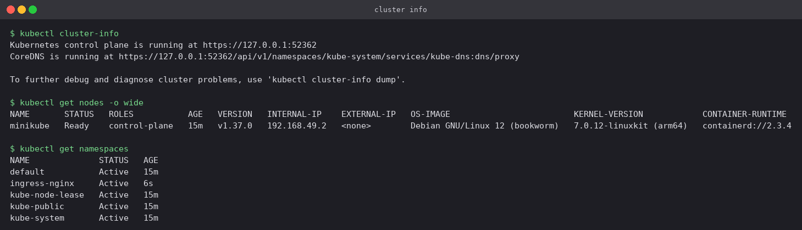
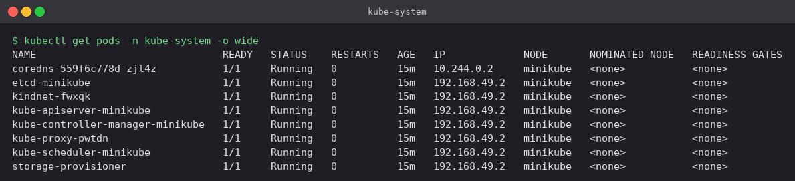
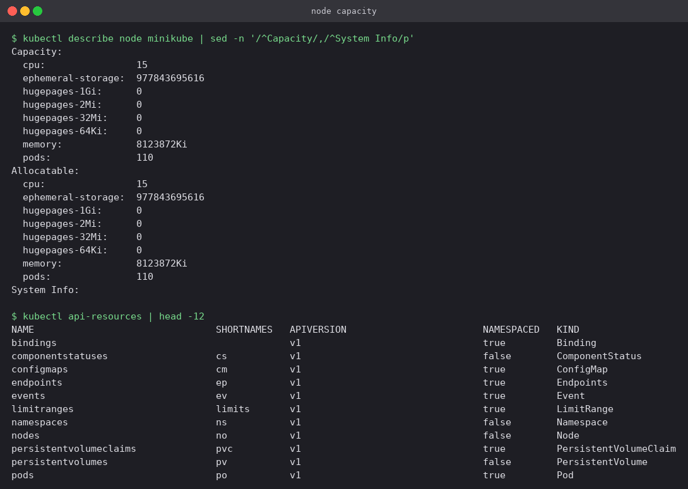
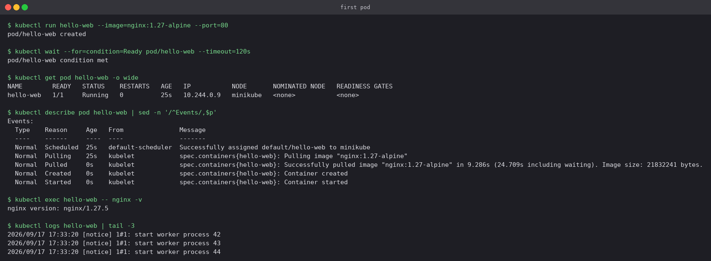

# Kubernetes Fundamentals

## At a glance

The control plane taken apart on a local single-node Minikube cluster: what each component
does, then proof that every one of them is running as an ordinary Pod you can `kubectl get`.
After that, a first Pod created by hand and read through its Events, and namespaces used to
run two Pods with the *same name* side by side.

Everything below is from a real run. The screenshots are the terminal output, not a
transcription of it.

**Environment:** Minikube with the Docker driver on macOS, Kubernetes v1.37.0, containerd.
The single node is called `minikube` and its IP is `192.168.49.2`.

```bash
minikube start --driver=docker
```

## Concepts

### Declarative, not imperative

You do not tell Kubernetes to *do* things. You write down the state you want, and a set of
control loops keeps working until reality matches it. Every component in the table below is a
loop watching for drift, not a command that runs once.

| Component | Runs on | Job |
|---|---|---|
| `kube-apiserver` | Control plane | The only way in. `kubectl` and every other component talks to it; nothing talks to etcd directly |
| `etcd` | Control plane | Key-value store holding the entire cluster state |
| `kube-scheduler` | Control plane | Picks a node for each Pod that does not have one yet |
| `kube-controller-manager` | Control plane | The control loops that drive actual state towards desired state |
| `kubelet` | Every node | Agent that starts the Pod's containers and reports back on them |
| `kube-proxy` | Every node | Writes the network rules that make Services reachable |
| `containerd` | Every node | The container runtime that actually runs containers |
| `CoreDNS` | Add-on | In-cluster DNS for Services and Pods |

### The path of a `kubectl apply`

```
kubectl ──► kube-apiserver ──► etcd            (desired state written down)
                  │
                  ├──► kube-scheduler          (assigns the Pod to a node)
                  │
                  └──► kubelet on that node ──► containerd ──► container running
                              │
                              └──► status reported back to the apiserver
```

No component in that chain talks to any other directly. They all read from and write to the
apiserver, which is why `kubectl describe` can show you every step as an Event.

### Namespaces

A namespace is a virtual cluster inside the real one. Object names only have to be unique
*within* a namespace, which is what lets `staging` and `default` both hold a `hello-web` Pod.
Not everything is namespaced: Nodes and PersistentVolumes are cluster-wide, which is why `-n`
has no effect on them.

## Lab

### 1. Cluster information

```bash
kubectl cluster-info
kubectl get nodes -o wide
kubectl get namespaces
```

**What you should see**

Minikube is a single-node cluster, so the one node named `minikube` is both control plane and
worker — on a real cluster these would be separate machines and the `ROLES` column would say
so. Four namespaces exist from the start: `default` (where your own objects go), `kube-system`
(the cluster's own components), and `kube-public` / `kube-node-lease` (node heartbeats).
`ingress-nginx` shows up too, because the ingress addon was enabled for a later lab.



### 2. The components are just Pods

```bash
kubectl get pods -n kube-system -o wide
```

**What you should see**

Every component in the concepts table, listed as an ordinary Pod. `etcd`, `kube-apiserver`,
`kube-controller-manager` and `kube-scheduler` run as static Pods on the control plane;
`kube-proxy` and `kindnet` (the CNI plugin) run one per node. Kubernetes runs itself on
itself.

Check the IP column. The control-plane components share `192.168.49.2`, the node's own IP,
because they run on the host network. `coredns` has `10.244.0.2` from the Pod network, like
any normal Pod.



### 3. Node capacity and the API surface

```bash
kubectl describe node minikube | sed -n '/^Capacity/,/^System Info/p'
kubectl api-resources | head -12
```

**What you should see**

`Capacity` is what the node physically has. `Allocatable` is what the scheduler is allowed to
hand out after reserving what the system needs — and the scheduler only ever works from
`Allocatable`. The cap of 110 Pods per node is a kubelet default, not a hardware limit.

`kubectl api-resources` is the fastest way to recall a short name (`po`, `cm`, `ns`, `pvc`)
and to check whether a resource is namespaced.



### 4. A first Pod

```bash
kubectl run hello-web --image=nginx:1.27-alpine --port=80
kubectl wait --for=condition=Ready pod/hello-web --timeout=120s
kubectl get pod hello-web -o wide
kubectl describe pod hello-web | sed -n '/^Events/,$p'
kubectl exec hello-web -- nginx -v
kubectl logs hello-web | tail -3
```

**What you should see**

The `Events` block is the most useful output in the whole lab, because it is the life of the
Pod in order:

**Scheduled** (the scheduler chose a node) → **Pulling** / **Pulled** (the kubelet asked
containerd for the image — 9.3s here, the first pull of that tag) → **Created** → **Started**

When a Pod is not running, this list almost always says why.

The Pod got IP `10.244.0.9` from the Pod network. That address belongs to the Pod, not to the
node, and it is gone the moment the Pod is replaced — which is the entire reason Services
exist. That is the subject of [`Kubernetes Services/`](../Kubernetes%20Services/README.md).



### 5. Namespaces

```bash
kubectl create namespace staging
kubectl run hello-web --image=nginx:1.27-alpine -n staging
kubectl get pods -A | grep -E 'NAMESPACE|hello-web'
```

**What you should see**

Two Pods called `hello-web`, one in `default` and one in `staging`, both happily running. A
name only has to be unique within its namespace. `-n <ns>` targets one namespace, `-A` lists
across all of them.


### 6. Two commands worth knowing early

```bash
kubectl run dry --image=nginx --dry-run=client -o yaml
kubectl explain pod.spec.containers.image
```

`--dry-run=client -o yaml` prints the manifest without creating anything — far faster than
writing YAML from a blank file. `kubectl explain` is the API reference built into the CLI, so
there is rarely a reason to guess at a field name.

## Cleanup

```bash
kubectl delete pod hello-web --wait=false
kubectl delete namespace staging --wait=false
```

Deleting a namespace deletes everything inside it, which is the quickest way to clean up an
experiment.

## Pitfalls

- **`kubectl` talking to the wrong cluster.** The context is global, not per-terminal. Run
  `kubectl config get-contexts` before anything destructive.
- **Forgetting `-n`.** Objects created without a namespace land in `default` and then appear
  "missing" when you look somewhere else. `-A` finds them.
- **Reading `Capacity` instead of `Allocatable`.** A node with 8 GB can advertise noticeably
  less to the scheduler, so a Pod that "obviously fits" can still sit in `Pending`.
- **`kubectl get pod` when the Pod is unhappy.** It gives you a status, never a reason.
  `kubectl describe pod` and its Events give the reason.
- **Assuming Pod IPs are stable.** They are assigned per Pod, not per workload, and change on
  every reschedule. Never write one into config.
- **Treating `kubectl run` as production practice.** It is fine for scratch work; anything you
  want to keep belongs in a manifest under version control.

## kubectl cheat sheet

| Command | Purpose |
|---|---|
| `kubectl get <type> [-o wide] [-n ns] [-A]` | List objects |
| `kubectl describe <type> <name>` | Details and Events — first stop when something is wrong |
| `kubectl logs <pod> [-f] [--previous]` | Container logs; `--previous` for a crashed container |
| `kubectl exec -it <pod> -- sh` | Shell inside a running container |
| `kubectl apply -f file.yaml` | Create or update from a manifest (declarative) |
| `kubectl delete -f file.yaml` | Remove whatever that manifest created |
| `kubectl run` / `kubectl create` | Quick imperative creation, useful for scratch work |
| `kubectl explain <type.field>` | Built-in field documentation |
| `kubectl config get-contexts` | Check which cluster you are actually talking to |

## Check yourself

1. `kubectl` never talks to etcd. What does it talk to, and why does that indirection matter?
2. A Pod has been in `Pending` for five minutes. Which single command tells you why?
3. Why can two Pods both be called `hello-web` in the same cluster?
4. The scheduler refuses to place a Pod that asks for 2 CPUs on an idle 2-CPU node. Why?
5. Why is a Pod's IP address a bad thing to write into an application's configuration?
