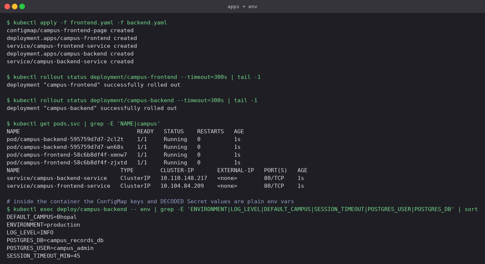
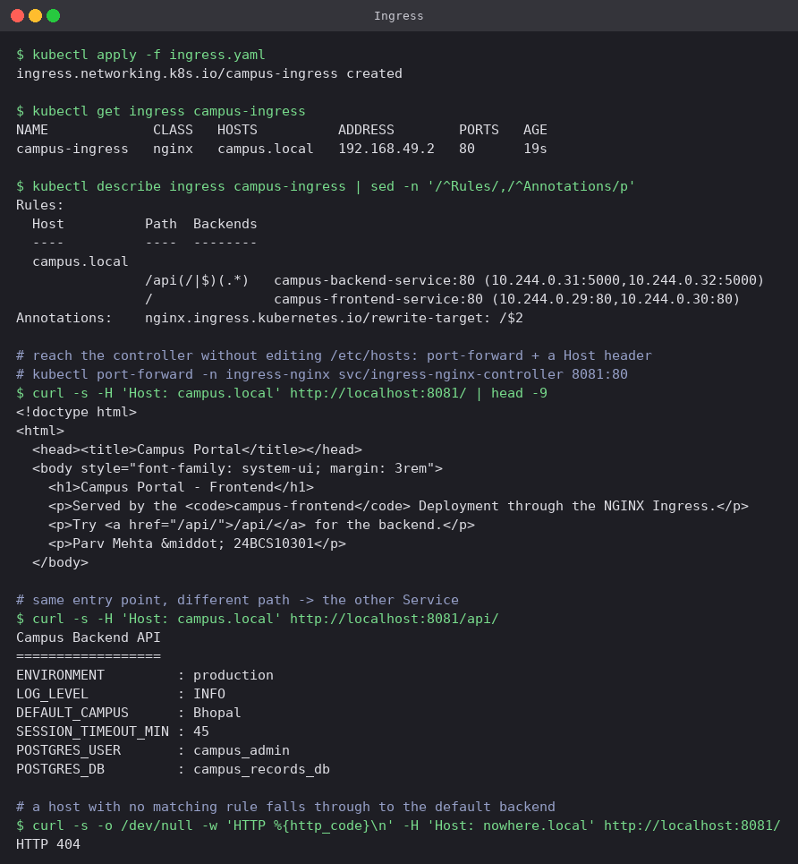

# Kubernetes Ingress, ConfigMaps and Secrets

## At a glance

Configuration pulled out of the image, credentials kept separate from it, and a single HTTP
entry point routing to two Services by path. A ConfigMap and a Secret are injected into a
Python backend as environment variables, and the backend echoes them straight back in its
response — so one `curl` proves the whole chain end to end: Ingress → Service → Pod → injected
configuration.

Manifests are in [`manifests/`](manifests); the screenshots are real terminal output. Commands
are written to be pasted from this folder.

```text
                         Host: campus.local
  curl / browser ──────────► NGINX Ingress Controller
                                     │
                    path /           │           path /api/...
                    ▼                                ▼
       campus-frontend-service            campus-backend-service    (both ClusterIP)
                    ▼                                ▼
          2 × Nginx Pods                    2 × Python API Pods
                                             ▲                ▲
                                        ConfigMap           Secret
                                    campus-app-config   campus-db-secret
```

## Concepts

| Object | Purpose |
|---|---|
| **ConfigMap** | Non-sensitive settings as key-value pairs, stored outside the image |
| **Secret** | Sensitive values (passwords, tokens, TLS keys), base64-encoded |
| **Ingress** | HTTP routing rules — host and path — in front of many Services |
| **Ingress Controller** | The reverse proxy (NGINX here) that actually reads Ingress objects and serves traffic |

### An Ingress object does nothing on its own

It is only data in etcd until a controller reads it and reconfigures itself. If you apply an
Ingress on a cluster with no controller installed, nothing breaks and nothing works — the
object just sits there. This is the single most common source of "my Ingress isn't working".

### Env vars vs volumes

| | `env` / `envFrom` | Mounted as a volume |
|---|---|---|
| How the app reads it | `os.getenv(...)` | A file on disk |
| Updated when the ConfigMap changes | **No** — read once at process start | Yes, refreshed in place (kubelet sync, up to ~1 min) |
| Good for | Settings fixed for the life of the Pod | Anything that changes often; whole config files |
| To pick up a change | `kubectl rollout restart deployment/<name>` | Nothing, if the app re-reads the file |

### Secrets are encoded, not encrypted

Base64 is an encoding, not a cipher. Anything that can read the Secret object can read the
secret. Real protection comes from three other places: RBAC restricting who can `get` it,
encryption at rest for etcd, and keeping Secret YAML out of Git entirely (Sealed Secrets, SOPS,
or an external vault). The `secret.yaml` committed here is a lab artefact with a fake password
— it is exactly what you should *not* do in a real repository.

## Lab

### 0. The Ingress controller

On Minikube the NGINX controller comes as an addon:

```bash
minikube addons enable ingress
kubectl get pods -n ingress-nginx
kubectl get ingressclass
```

**What you should see**

The controller Pod `Running` in the `ingress-nginx` namespace, and an IngressClass named
`nginx (default)` — that is what `ingressClassName: nginx` in the Ingress manifest selects.

### 1. ConfigMap

[`manifests/configmap.yaml`](manifests/configmap.yaml)

```bash
kubectl apply -f manifests/configmap.yaml
kubectl get configmap campus-app-config
kubectl describe configmap campus-app-config | sed -n '/^Data/,/^BinaryData/p'

# ConfigMaps can also be built straight from the CLI
kubectl create configmap cli-demo-config \
  --from-literal=FEATURE_ATTENDANCE=true --from-literal=REGION=ap-south-1
kubectl get configmap cli-demo-config -o jsonpath='{.data}'
```

**What you should see**

`describe` prints every value in full. A ConfigMap is plain text, and that is precisely the
difference from the Secret in the next step. The point of it is that the *same image* runs in
dev and in production with different ConfigMaps attached, so a config change never requires a
rebuild.

`--from-literal` (and `--from-file`, and `--from-env-file`) are the quick imperative routes;
for anything that lives in Git, the YAML form is what you want.


### 2. Secret

[`manifests/secret.yaml`](manifests/secret.yaml)

```bash
kubectl apply -f manifests/secret.yaml
kubectl get secret campus-db-secret
kubectl describe secret campus-db-secret | sed -n '/^Type/,$p'

kubectl get secret campus-db-secret -o jsonpath='{.data.POSTGRES_USER}'
kubectl get secret campus-db-secret -o jsonpath='{.data.POSTGRES_USER}' | base64 --decode

echo -n 'campus_admin' | base64
echo    'campus_admin' | base64
```

**What you should see**

Three things this run makes concrete:

- `kubectl describe secret` prints only the **size** of each value (`12 bytes`), never the
  value. That is a display convenience, not a security boundary.
- One `jsonpath` plus `base64 --decode` gets the password back in plain text. Encoded, not
  encrypted.
- **The `echo -n` trap**, in the last two lines: `echo -n 'campus_admin' | base64` gives
  `Y2FtcHVzX2FkbWlu`, but dropping `-n` gives `Y2FtcHVzX2FkbWluCg==`. The extra `Cg==` is an
  encoded newline that becomes part of the password, producing authentication failures that
  look inexplicable because the value *looks* right everywhere you print it. Use `echo -n`, or
  sidestep it completely by writing plain text under `stringData:` and letting Kubernetes do
  the encoding.


### 3. Injecting both into the applications

[`manifests/frontend.yaml`](manifests/frontend.yaml),
[`manifests/backend.yaml`](manifests/backend.yaml)

The backend deliberately uses both injection styles so the difference is visible in one place:

```yaml
envFrom:
  - configMapRef:
      name: campus-app-config      # every key becomes an env var
env:
  - name: POSTGRES_USER
    valueFrom:
      secretKeyRef:                # one named key, chosen explicitly
        name: campus-db-secret
        key: POSTGRES_USER
```

```bash
kubectl apply -f manifests/frontend.yaml -f manifests/backend.yaml
kubectl rollout status deployment/campus-frontend --timeout=300s
kubectl rollout status deployment/campus-backend  --timeout=300s
kubectl get pods,svc | grep -E 'NAME|campus'
kubectl exec deploy/campus-backend -- env | grep -E 'ENVIRONMENT|POSTGRES_USER' | sort
```

**What you should see**

Inside the container both sources have collapsed into ordinary environment variables, and the
Secret values arrive **already decoded** (`POSTGRES_USER=campus_admin`). The application code
needs to know nothing about Kubernetes — it just reads its environment.

The frontend takes the other route: its page comes from a ConfigMap mounted as a volume at
`/usr/share/nginx/html`, which is the pattern to use for whole config files.



### 4. Ingress

[`manifests/ingress.yaml`](manifests/ingress.yaml): host `campus.local`, with
`/api(/|$)(.*)` → backend (rewritten by `rewrite-target: /$2`) and `/` → frontend.

Rather than editing `/etc/hosts`, the controller is reached through a port-forward and the
hostname supplied as a header. Routing is decided by the `Host` header either way, so the
result is identical. Run the port-forward in a second terminal and leave it running:

```bash
kubectl port-forward -n ingress-nginx svc/ingress-nginx-controller 8081:80
```

```bash
kubectl apply -f manifests/ingress.yaml
kubectl get ingress campus-ingress
kubectl describe ingress campus-ingress | sed -n '/^Rules/,/^Annotations/p'

curl -s -H 'Host: campus.local' http://localhost:8081/        | head -9
curl -s -H 'Host: campus.local' http://localhost:8081/api/
curl -s -o /dev/null -w 'HTTP %{http_code}\n' -H 'Host: nowhere.local' http://localhost:8081/
```

**What you should see**

- **One entry point, two Services.** `/` returns the frontend HTML and `/api/` returns the
  backend's plain-text response, both on the same port. Neither Service is exposed outside the
  cluster — they are both plain ClusterIP.
- `describe ingress` resolves each rule down to actual Pod endpoints
  (`10.244.0.31:5000,10.244.0.32:5000`), which makes it the fastest way to tell "the Ingress is
  wrong" apart from "the Service has no Pods".
- The backend response carries `ENVIRONMENT: production` and `DEFAULT_CAMPUS: Bhopal` from the
  **ConfigMap**, and `POSTGRES_USER: campus_admin` from the **Secret**. That single body is the
  whole chain proved end to end.
- `rewrite-target: /$2` strips the `/api` prefix, so the backend sees `/` and does not need to
  know the public path it is mounted at.
- `Host: nowhere.local` returns **404** from the controller's default backend. No rule matched,
  so routing really is host-based — one controller can serve many unrelated hostnames.



Compared with giving every Service its own LoadBalancer, an Ingress needs one external address
in total and adds path routing, host routing and TLS termination in a single object. The five
Service types it sits in front of are covered in
[`Kubernetes Services/`](../Kubernetes%20Services/README.md).

## Cleanup

```bash
kubectl delete -f manifests/
kubectl delete configmap cli-demo-config
```

## Pitfalls

- **Editing a ConfigMap and expecting running Pods to notice.** Env vars are read once at
  process start. `kubectl rollout restart deployment/<name>`, or mount the ConfigMap as a
  volume.
- **`echo` without `-n` when encoding a Secret.** The trailing newline silently becomes part of
  the value. Prefer `stringData:` and let Kubernetes encode.
- **Committing `secret.yaml`.** Base64 hides nothing from anyone with the file. Real secrets
  belong in Sealed Secrets, SOPS or a vault.
- **Applying an Ingress on a cluster with no controller.** The object is accepted and nothing
  happens. `kubectl get ingressclass` first.
- **Forgetting `ingressClassName`.** On a cluster with more than one controller, an Ingress
  with no class is picked up by whichever one claims the default — or by nobody.
- **Regex paths without `use-regex`.** `/api(/|$)(.*)` is matched literally without that
  annotation, and `rewrite-target: /$2` then has no capture group to use.
- **A 404 from the Ingress with a healthy app.** Check the `Host` header before anything else;
  a rule bound to `campus.local` ignores a request that does not carry it.
- **`describe ingress` showing an empty backend.** That is a Service problem, not an Ingress
  problem — go look at its endpoints.

## Check yourself

1. You change `LOG_LEVEL` in a ConfigMap. The Pods keep logging at the old level. Why, and what
   are your two options?
2. Someone says Secrets are "encrypted in etcd by default". What is wrong with that sentence?
3. `kubectl get ingress` shows your rules and the app is healthy, but every request 404s. Name
   two things to check.
4. What does `rewrite-target: /$2` do, and what would the backend receive without it?
5. When would you reach for an Ingress instead of just giving each Service `type: LoadBalancer`?
