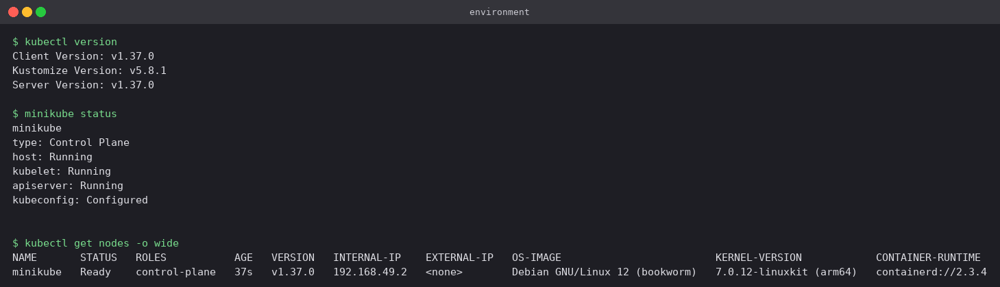
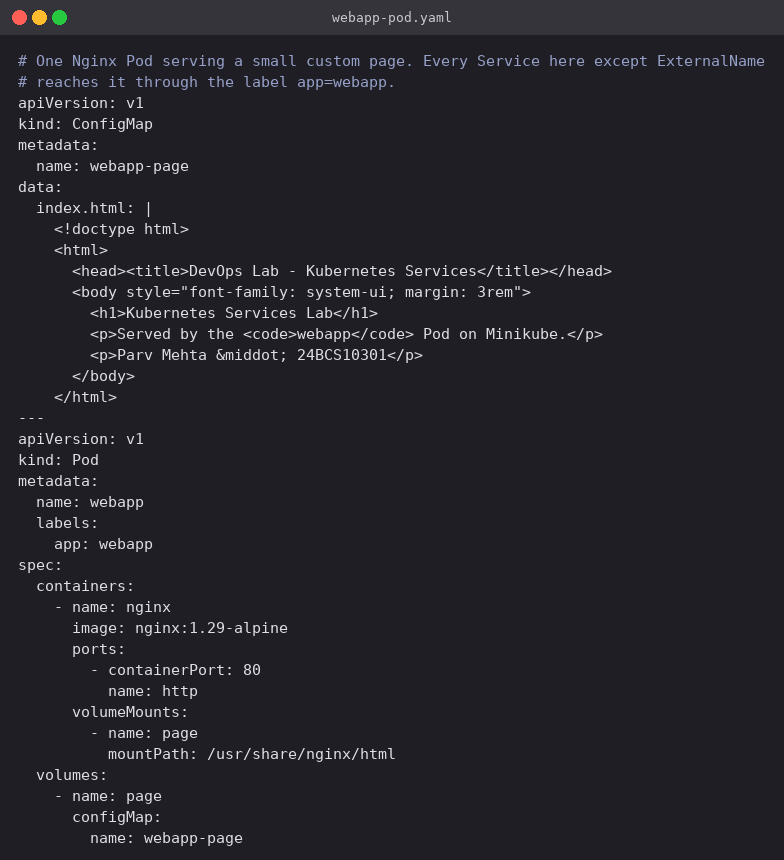
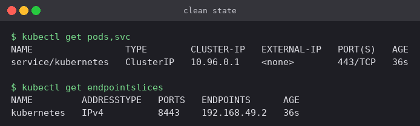
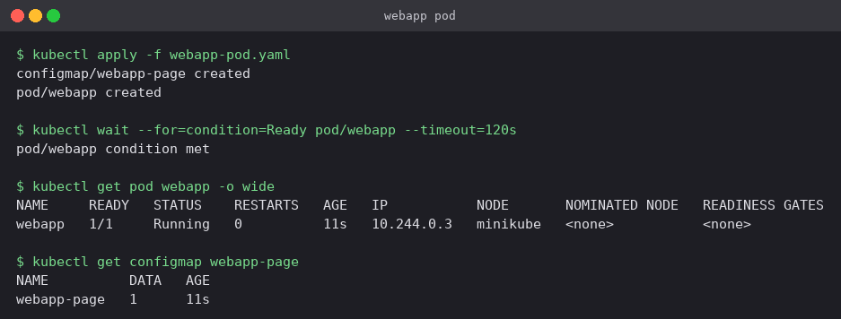
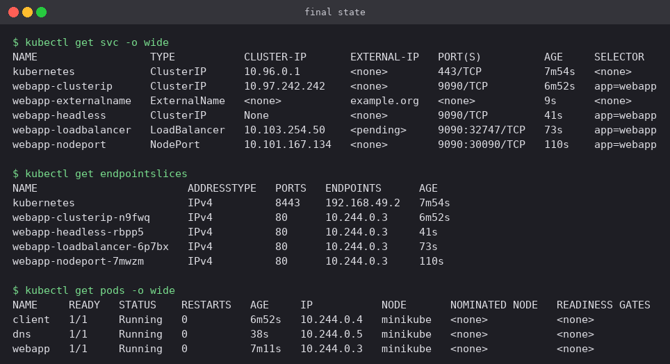
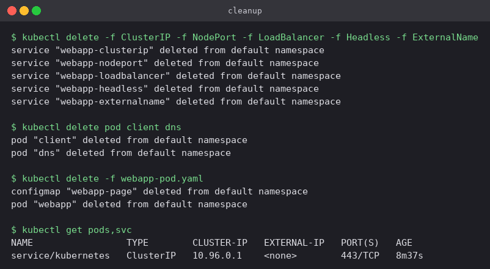

# Kubernetes Services

## At a glance

A Pod on its own is not addressable in any useful way: its IP changes the moment it is
rescheduled. A Service is the stable front door. This folder works through all five Service
types against **one and the same Nginx Pod**, and tests each one from the place it is actually
supposed to be reachable from — another Pod, the node itself, the laptop, or plain DNS.

Each type has its own subfolder holding its manifest, the commands, what they printed, and the
screenshots from the run.

**Environment:** Minikube v1.39.0 with the Docker driver on macOS (Apple silicon), Kubernetes
v1.37.0, containerd 2.3.4. The node's internal IP is `192.168.49.2` and the Pod was scheduled
onto `10.244.0.3`.



## Concepts

### The three that layer

The first three types are a stack, not three unrelated options:

```
LoadBalancer   cloud external IP  ──┐
                                    ├──► NodePort   port 30000-32767 on every node  ──┐
                                                                                      ├──► ClusterIP   virtual IP + kube-proxy rules  ──► Pods
```

- **ClusterIP** is the base — a virtual IP plus kube-proxy rules that forward to the matching
  Pods.
- **NodePort** is a ClusterIP *plus* a port reserved on every node.
- **LoadBalancer** is a NodePort *plus* a request to the cloud provider for an external IP
  pointing at that node port.

This is visible in the output rather than just being a claim: `webapp-loadbalancer` still has a
ClusterIP (`10.103.254.50`) and still had node port `32747` allocated to it, even though no
external IP ever showed up.

### The two that do not

**Headless** and **ExternalName** are a different kind of thing altogether. Neither gets a
virtual IP and kube-proxy is not involved in either. Headless publishes the Pod IPs through DNS
and lets the client choose; ExternalName is nothing but a CNAME pointing out of the cluster.

### The selector is the only wire

A Service has no list of Pods. It has a label selector, and the endpoints controller keeps an
EndpointSlice up to date with whatever currently matches. Get the selector wrong and the
Service is created successfully, looks healthy in `kubectl get svc`, and routes to nothing —
[ClusterIP/](ClusterIP/) reproduces that on purpose.

## The Pod under test

[`webapp-pod.yaml`](webapp-pod.yaml) holds two objects: a ConfigMap with a small HTML page, and
a Pod running `nginx:1.29-alpine` that mounts it at `/usr/share/nginx/html`. The container port
80 is given the name `http`, and the Pod carries the label `app: webapp`.

Those two details are what make the rest of the folder work. Every selector-based Service
matches on `app: webapp`, and each one writes `targetPort: http` instead of `targetPort: 80` —
referring to the port by name means the Service keeps working if the container ever moves to a
different port number.



```bash
kubectl apply -f webapp-pod.yaml
kubectl wait --for=condition=Ready pod/webapp --timeout=180s
```

The cluster before anything was applied, and then the Pod running:




Two throwaway Pods are created once and reused by every check that follows — `client` to make
HTTP requests from inside the cluster, and `dns` to run `nslookup`:

```bash
kubectl run client --image=curlimages/curl:8.11.1 --restart=Never --command -- sleep 3600
kubectl run dns    --image=busybox:1.37           --restart=Never --command -- sleep 3600
kubectl wait --for=condition=Ready pod/client pod/dns --timeout=120s
```

## The five types

| Folder | Service | Reachable from | How it was verified |
|---|---|---|---|
| [ClusterIP](ClusterIP/) | `webapp-clusterip` | inside the cluster only | `curl` from the `client` Pod returned 200; the same IP from the laptop timed out |
| [NodePort](NodePort/) | `webapp-nodeport` `9090:30090` | any node IP on port 30090 | `curl` from inside the node, then a `minikube service` tunnel in the browser |
| [LoadBalancer](LoadBalancer/) | `webapp-loadbalancer` | an external IP handed out by the cloud | `EXTERNAL-IP` sits at `<pending>` on Minikube; the NodePort underneath works anyway |
| [Headless](Headless/) | `webapp-headless` (`clusterIP: None`) | through DNS, straight to the Pod IPs | `nslookup` answered `10.244.0.3`, which is the Pod's own IP |
| [ExternalName](ExternalName/) | `webapp-externalname` | resolves to `example.org` | `nslookup` answered with a CNAME to `example.org` |

### Choosing one

| You need | Use |
|---|---|
| Other Pods to reach it, nothing else | ClusterIP |
| A quick way in from outside on a bare-metal or local cluster | NodePort |
| A real public address on a managed cloud | LoadBalancer |
| One specific replica by name (StatefulSets, databases, brokers) | Headless |
| A stable in-cluster alias for something outside the cluster | ExternalName |
| HTTP routing by host or path for many Services behind one address | An [Ingress](../Kubernetes%20Ingress%20and%20Config/README.md), not a Service type |

## Final state

All five Services, the EndpointSlices behind them, and the three Pods:



Worth noticing in that output: the four selector-based Services each got their own
EndpointSlice listing `10.244.0.3:80`, while `webapp-externalname` has none — there is nothing
for it to point at inside the cluster.

## Cleanup

```bash
kubectl delete -f ClusterIP -f NodePort -f LoadBalancer -f Headless -f ExternalName
kubectl delete pod client dns
kubectl delete -f webapp-pod.yaml
```



## Pitfalls

- **A Service with no endpoints.** `kubectl get svc` looks perfectly normal. Run
  `kubectl get endpointslices -l kubernetes.io/service-name=<svc>` — it answers "is anything
  actually behind this?" in one line.
- **Confusing `port` with `targetPort`.** `port` is what clients dial on the Service;
  `targetPort` is the container's port. They are deliberately different throughout this folder
  (9090 → 80) so the output is unambiguous.
- **Timeout vs connection refused.** A *timeout* usually means a network or firewall problem. An
  *immediate refusal* on a name that resolves usually means the Service has no endpoints.
- **Expecting `EXTERNAL-IP` to fill in on a local cluster.** Minikube ships no cloud controller
  manager, so `type: LoadBalancer` stays `<pending>` forever. That is the expected result, not a
  fault.
- **Expecting a node IP to be routable from macOS.** With the Docker driver the "node" is a
  container inside the Docker VM. Use `minikube service <name> --url`.
- **Using the Service `port` against a headless Service.** No proxy is involved, so you have to
  dial the container's real port. `port` on a headless Service only matters for SRV records.
- **ExternalName over HTTP without fixing the `Host` header.** The alias rewrites DNS, not the
  request. The real server has never heard of your in-cluster name.
- **`nslookup` in busybox without `-type=a` and an FQDN.** It also tries AAAA and walks the
  search domains, burying the answer in NXDOMAIN noise.

## Check yourself

1. A Service and its Pods are both `Running`, but `curl` from another Pod is refused instantly.
   What is the first command you run?
2. Why does a LoadBalancer Service still have a ClusterIP and a node port?
3. What does `clusterIP: None` switch off, and which workload type depends on that behaviour?
4. `targetPort: http` instead of `targetPort: 80` — what does that buy you?
5. An ExternalName Service resolves correctly but every HTTP request comes back 404. Why?
