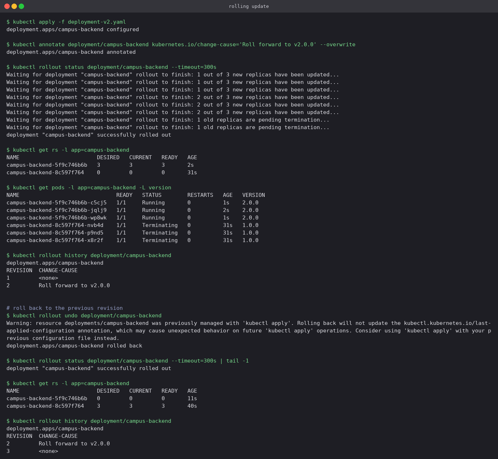

# Kubernetes Workloads

## At a glance

Pods, ReplicaSets, Deployments and DaemonSets, run in that order so each one demonstrates what
the previous one could not do. A bare Pod is deleted and stays deleted; a ReplicaSet replaces
a Pod killed on purpose; a Deployment rolls from v1 to v2 and back again; a deliberately
broken image tag shows what a *failed* rollout looks like and why it did not take the app
down. Finally a DaemonSet, which has no replica count at all.

Manifests are in [`manifests/`](manifests) and every screenshot is real terminal output from
the run. Commands are written to be pasted from this folder.

**Environment:** Minikube, Docker driver, single node. Start it with
`minikube start --driver=docker`.

## Concepts

### The ladder

| Object | What it adds over the one above | Owns |
|---|---|---|
| **Pod** | The smallest unit — one or more containers sharing an IP and volumes. Nothing restarts it if it dies | — |
| **ReplicaSet** | Keeps N matching Pods alive at all times: self-healing and scaling | Pods |
| **Deployment** | Manages ReplicaSets, which buys rolling updates, revision history and rollback | ReplicaSets |
| **DaemonSet** | One Pod per node, however many nodes there are | Pods |

```
Deployment  campus-backend
      │  creates one ReplicaSet per template revision
      ├── ReplicaSet campus-backend-8c597f764   (v1, scaled to 0 after the update)
      └── ReplicaSet campus-backend-5f9c746b6b  (v2, scaled to 3)
                 └── Pod campus-backend-5f9c746b6b-xxxxx
```

You never create the middle layer yourself. The hash in the Pod name *is* the template hash of
the ReplicaSet that owns it, which is why you can read the whole chain off `kubectl get pods`.

### Selectors, not names

A controller finds its Pods purely through the **label selector**. It holds no list of Pod
names — names carry a random suffix precisely because they are disposable. Get the selector
wrong and the controller quietly manages nothing.

### Rolling update strategy

`maxSurge` is how many Pods above the desired count may exist during an update; `maxUnavailable`
is how many below it. The manifests here use `maxSurge: 1, maxUnavailable: 0`, which means a
new Pod must become Ready before an old one is allowed to go. That is what makes the update
zero-downtime, and it is also what saves the application in step 4.

## Lab

### 1. A bare Pod is not protected

[`manifests/demo-pod.yaml`](manifests/demo-pod.yaml)

```bash
kubectl apply -f manifests/demo-pod.yaml
kubectl wait --for=condition=Ready pod/campus-demo-pod --timeout=180s
kubectl get pod campus-demo-pod -o wide --show-labels
kubectl delete pod campus-demo-pod
kubectl get pods
```

**What you should see**

The last command is the whole lesson: `No resources found`. Nobody brought the Pod back,
because nothing was watching it. This is why Pods are essentially never created directly
outside of debugging — something has to own them.


### 2. ReplicaSet — self-healing and scaling

[`manifests/backend-rs.yaml`](manifests/backend-rs.yaml) asks for `replicas: 3` matching
`app=campus-backend`.

```bash
kubectl apply -f manifests/backend-rs.yaml
kubectl wait --for=condition=Ready pod -l app=campus-backend --timeout=240s
kubectl get rs,pods -l app=campus-backend

# kill one on purpose — use a name from the list above
kubectl delete pod campus-backend-rs-jqbmr --wait=false
kubectl get pods -l app=campus-backend

kubectl scale rs campus-backend-rs --replicas=5
kubectl describe rs campus-backend-rs | sed -n '/^Events/,$p'
```

**What you should see**

- The deleted Pod (`campus-backend-rs-jqbmr`) is already being replaced by the very next
  command: `campus-backend-rs-vz8cc` is in `ContainerCreating` **while the old one is still
  `Terminating`**. The controller does not wait for the deletion to finish; it reacts the
  moment the observed count drops below 3.
- `kubectl scale --replicas=5` adds two more, and the `Events` list records a
  `SuccessfulCreate` for every Pod the ReplicaSet has ever made.
- What a ReplicaSet **cannot** do is change the image in a controlled way. Editing the template
  leaves the existing Pods untouched. That gap is exactly what a Deployment fills.


Delete it before the next step so the label selector does not overlap:

```bash
kubectl delete rs campus-backend-rs
```

### 3. Deployment — rolling update, history, rollback

[`deployment-v1.yaml`](manifests/deployment-v1.yaml) →
[`deployment-v2.yaml`](manifests/deployment-v2.yaml). The two files differ only in the version
label and the line the container prints.

```bash
kubectl apply -f manifests/deployment-v1.yaml
kubectl rollout status deployment/campus-backend --timeout=300s
kubectl get deploy,rs,pods -l app=campus-backend
```

**What you should see**

The three-level chain, visible in the Pod names themselves: `campus-backend` (the Deployment)
+ `8c597f764` (the ReplicaSet's template hash) + a per-Pod suffix.


Now roll forward and back:

```bash
kubectl apply -f manifests/deployment-v2.yaml
kubectl annotate deployment/campus-backend \
  kubernetes.io/change-cause='Roll forward to v2.0.0' --overwrite
kubectl rollout status deployment/campus-backend --timeout=300s
kubectl get rs -l app=campus-backend
kubectl get pods -l app=campus-backend -L version

kubectl rollout history deployment/campus-backend
kubectl rollout undo deployment/campus-backend
```

**What you should see**

- Applying v2 did not modify the existing ReplicaSet. It created a **new** one (`5f9c746b6b`)
  and scaled it up while scaling `8c597f764` down to zero, one replica at a time —
  `rollout status` narrates each step.
- `-L version` prints the `version` label as a column, so the changeover is visible directly:
  three Pods `Terminating` at `1.0.0` next to three `Running` at `2.0.0`.
- The old ReplicaSet is **kept at 0 replicas** rather than deleted. That is what makes rollback
  instant — `kubectl rollout undo` just scales `8c597f764` back to 3, with no image pull
  needed.
- After the undo, `rollout history` shows revisions 2 and 3, not 1 and 2. A rollback is
  recorded as a *new* revision rather than erasing one. The `CHANGE-CAUSE` column is filled in
  from the `kubernetes.io/change-cause` annotation, which is worth setting on every release.



### 4. Troubleshooting a bad image

A deliberately wrong tag, to see what a failed rollout looks like:

```bash
kubectl set image deployment/campus-backend backend=campus-backend:no-such-tag-v999
kubectl get pods -l app=campus-backend
kubectl describe pod <the-failing-pod> | grep -E 'Failed|Back-off' | head -3
kubectl rollout undo deployment/campus-backend
```

**What you should see**

- The new Pod sits in `ImagePullBackOff`, and `kubectl describe pod` gives the precise reason:
  `pull access denied, repository does not exist`.
- The important part is the three Pods underneath it, all still `Running` on the old version.
  Because the new Pod never became Ready and `maxUnavailable` is 0, Kubernetes refused to
  remove any of them. **A broken deploy did not take the application down** — the rollout
  simply stalled.
- `kubectl rollout undo` clears it. Note the warning it prints: rolling back does not update
  the `last-applied-configuration` annotation, so a later `kubectl apply` of an old file can
  behave unexpectedly. Re-applying the known-good manifest is the tidier fix in a real
  workflow.


The debugging order that works almost every time: `kubectl get pods` → `kubectl describe pod`
(read the Events) → `kubectl logs`, adding `--previous` when the container is crash-looping.

### 5. DaemonSet

[`manifests/node-agent-ds.yaml`](manifests/node-agent-ds.yaml)

```bash
kubectl apply -f manifests/node-agent-ds.yaml
kubectl rollout status ds/node-metrics-agent --timeout=240s
kubectl get ds node-metrics-agent
kubectl get pods -l app=node-metrics-agent -o wide
kubectl describe node minikube | grep Taints
```

**What you should see**

There is no `replicas` field anywhere in that manifest — the replica count *is* the node count.
`DESIRED` is 1 here only because this cluster has one node; adding a second node would create a
second Pod with no change to the manifest.

`kubectl describe node minikube | grep Taints` returns `<none>`, which is worth contrasting
with a multi-node cluster. There the control-plane node normally carries a
`node-role.kubernetes.io/control-plane:NoSchedule` taint, so a DaemonSet without a matching
toleration lands only on the workers and `DESIRED` comes out lower than the node count.
Minikube's single node is untainted so that ordinary workloads can run on it at all.

DaemonSets are how log collectors, monitoring agents and CNI plugins are deployed —
`kube-proxy` and `kindnet` in this very cluster are DaemonSets themselves.


## Pod status cheat sheet

| Status | Meaning | First thing to check |
|---|---|---|
| `Pending` | Not scheduled yet | `describe pod`: insufficient CPU/memory, taints, unbound PVC |
| `ContainerCreating` | Pulling the image or mounting volumes | Wait a moment, then `describe pod` |
| `ImagePullBackOff` / `ErrImagePull` | Bad image name or tag, or no registry access | Spelling, tag, pull secret |
| `CrashLoopBackOff` | Container starts and exits repeatedly | `kubectl logs --previous` |
| `Running` but `0/1 READY` | Readiness probe failing | Probe path and port, app logs |
| `Completed` | Exited 0 — normal for Jobs, not for a Deployment | Whether it should be long-running |
| `Terminating` | Shutting down (30s grace period by default) | Stuck? Check finalizers |

## Cleanup

```bash
kubectl delete -f manifests/
```

## Pitfalls

- **Two controllers, one label.** A ReplicaSet and a Deployment that both select
  `app=campus-backend` will fight over the same Pods. Delete the ReplicaSet from step 2 before
  applying the Deployment.
- **Editing a ReplicaSet's template and expecting a rollout.** Nothing happens to the existing
  Pods. Use a Deployment.
- **`kubectl apply` after a `rollout undo`.** The undo does not refresh
  `last-applied-configuration`, so the next apply of a stale file can resurrect the version you
  just rolled back from.
- **`maxUnavailable` greater than 0 on a small Deployment.** With 2 replicas and
  `maxUnavailable: 1` a bad image takes out half your capacity before the rollout stalls.
- **Believing `kubectl get pods` when it says `Running`.** `Running` means the container
  started, not that it is serving. Watch the `READY` column, which reflects the readiness
  probe.
- **Deleting a Pod to "restart" a Deployment.** You get a new Pod from the same template, which
  changes nothing. `kubectl rollout restart deployment/<name>` is the command you want.
- **No `change-cause`.** `rollout history` is close to useless without it — every revision
  reads `<none>`.

## Check yourself

1. You delete a Pod created by a Deployment and it comes back. You delete a bare Pod and it
   does not. Which object is responsible for the difference, and how does it find the Pod?
2. A rollout is stuck: one new Pod in `ImagePullBackOff`, three old Pods still `Running`. Is
   the application down? What setting decides that?
3. Why does a rollback take seconds when the original rollout took a minute?
4. `kubectl rollout history` shows revisions 2 and 3 after you undo. Where did revision 1 go?
5. A DaemonSet reports `DESIRED 2` on a three-node cluster. Give the most likely reason.
