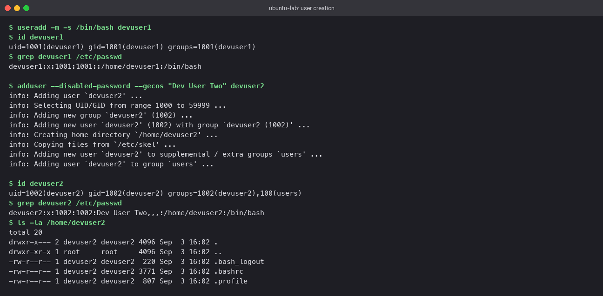
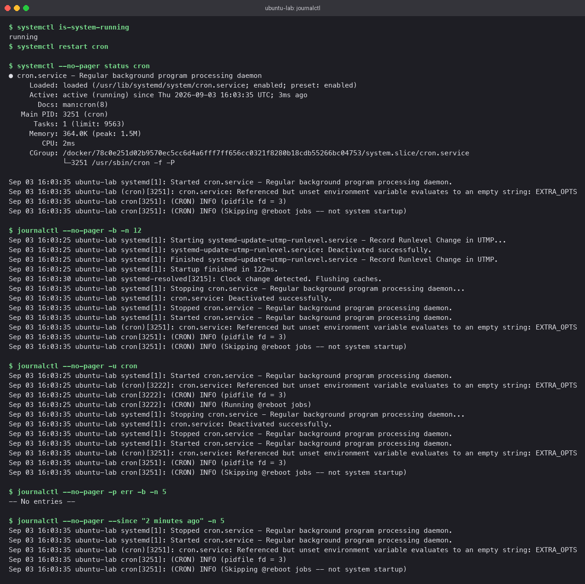
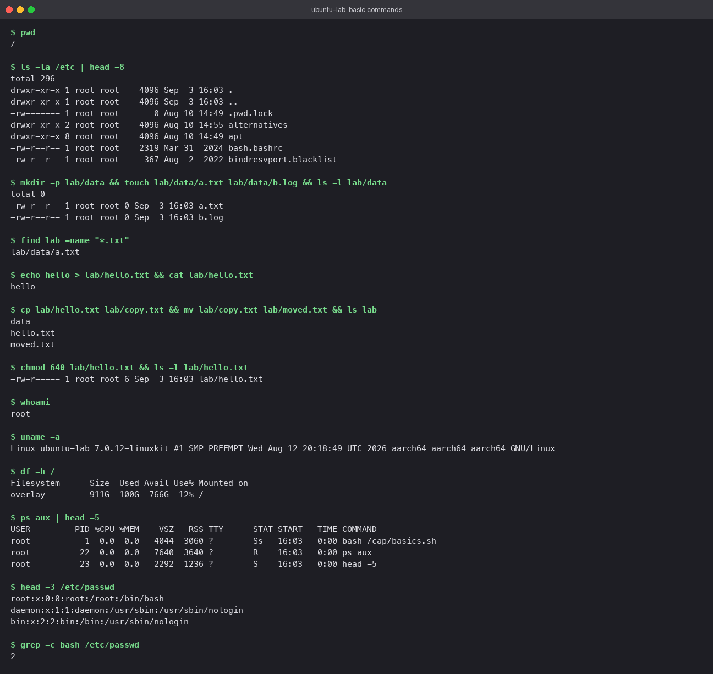

# Linux Fundamentals

## At a glance

Four exercises that build the mental model most Linux work rests on: how file names relate to
data on disk (links), how accounts are created (`useradd` vs `adduser`), how to read what the
system has been doing (`journalctl`), and a cheat sheet of the commands you will type every day.

All commands were run in an `ubuntu:24.04` container named `ubuntu-lab`. Start one with:

```bash
docker run -it --rm --hostname ubuntu-lab ubuntu:24.04 bash
```

## Concepts

### Names, inodes, and data

On a Linux filesystem a file has three separate parts:

```
directory entry  ──►  inode  ──►  data blocks
   ("notes.txt")      (owner, mode,      (the bytes)
                       size, link count,
                       block pointers)
```

The **name** is only a directory entry pointing at an **inode**. The inode holds metadata and
pointers to the data. This split is what makes links possible.

- A **hard link** adds a second directory entry to the *same inode*. Neither name is the
  original; both are equal. The inode's link count goes up, and the data is freed only when
  the count reaches zero.
- A **symbolic link** is a tiny file of its own whose content is a *path*. It has its own
  inode. If the path stops resolving, the link is left dangling.

| Question | Hard link | Symbolic link |
|---|---|---|
| Shares the target's inode? | Yes | No, has its own |
| Still works after `rm target`? | Yes | No (dangling) |
| Can cross filesystems? | No | Yes |
| Can point at a directory? | No (as a normal user) | Yes |
| How `ls -l` shows it | Indistinguishable from a regular file | `l` in the mode column and `-> target` |
| Typical use | Deduplicating identical files on one disk | Shortcuts, versioned binaries (`python3 -> python3.12`) |

### Two ways to create a user

| | `useradd` | `adduser` |
|---|---|---|
| What it is | Low-level binary from shadow-utils | Debian/Ubuntu Perl wrapper around `useradd` |
| Creates a home directory | Only with `-m` | Always |
| Copies `/etc/skel` | Only with `-m` | Always |
| Default shell | System default (`/bin/sh` on Debian) | `/bin/bash` |
| Sets a password | No | Prompts (unless `--disabled-password`) |
| Interactive | Never | By default |
| Best for | Scripts, Dockerfiles, automation | Interactive admin work |

Rule of thumb: **`adduser` when a human is typing, `useradd` when a script is running.**

### The systemd journal

`systemd-journald` collects logs from the kernel, from every service's stdout/stderr, and from
syslog into one indexed binary store. `journalctl` is the query tool. Instead of guessing which
file under `/var/log` holds the message, you filter by unit, priority, boot, or time.

## Lab

### 1. Hard link vs symbolic link

```bash
mkdir -p ~/linklab && cd ~/linklab
echo "line one" > notes.txt

ln    notes.txt notes-hard.txt      # hard link
ln -s notes.txt notes-soft.txt      # symbolic link

ls -li                              # -i prints the inode number
stat -c "%n  inode=%i  links=%h" notes.txt notes-hard.txt notes-soft.txt

echo "line two" >> notes-hard.txt   # write through the hard link
cat notes.txt                       # both lines appear: same data

rm notes.txt                        # remove the original name
cat notes-hard.txt                  # still works
cat notes-soft.txt                  # No such file or directory
```

**What you should see**

- `notes.txt` and `notes-hard.txt` report the *same* inode number and a link count of `2`.
- `notes-soft.txt` has a *different* inode and a link count of `1`.
- After deleting `notes.txt`, the hard link still prints both lines while the symlink fails.


### 2. `useradd` vs `adduser`

The stock `ubuntu:24.04` image does not include `adduser`, so install it first.

```bash
apt-get update -qq && apt-get install -y -qq adduser

# low level: spell out everything you want
useradd -m -s /bin/bash devuser1
id devuser1
grep devuser1 /etc/passwd
ls -la /home/devuser1

# high level: sensible defaults, non-interactive flags added for the lab
adduser --disabled-password --gecos "Dev User Two" devuser2
id devuser2
grep devuser2 /etc/passwd
ls -la /home/devuser2
```

**What you should see**

- `useradd` is silent. The account exists with the next free UID and the home directory you
  asked for, and nothing more.
- `adduser` narrates each step: picking the UID, creating the group, creating the home,
  copying skeleton files, adding the user to `users`. The GECOS field
  (`Dev User Two,,,`) and `/bin/bash` show up in `/etc/passwd`, and the home already holds
  `.bashrc`, `.profile`, and `.bash_logout`.



### 3. Reading logs with `journalctl`

A plain container has no init system, so there is no journal to read. To practise properly,
run a container with systemd as PID 1:

```bash
docker run -d --name systemd-lab --privileged --cgroupns=host \
  -v /sys/fs/cgroup:/sys/fs/cgroup:rw ubuntu:24.04 \
  bash -c "apt-get update -qq && apt-get install -y -qq systemd cron && exec /usr/lib/systemd/systemd"

docker exec -it systemd-lab bash
systemctl is-system-running        # wait until this prints "running"
```

Then generate some log lines and read them back several ways:

```bash
systemctl restart cron
systemctl --no-pager status cron

journalctl --no-pager -b -n 12                  # last 12 lines of this boot
journalctl --no-pager -u cron                   # everything from one unit
journalctl --no-pager -p err -b -n 5            # only errors and worse
journalctl --no-pager --since "2 minutes ago"   # time window
```

**What you should see**

- The `-u cron` output contains the stop/start pair from the restart and cron's own startup
  message.
- `-p err` prints `-- No entries --` because nothing has failed.
- The `--since` filter returns only the most recent lines.



The flags you will use most:

```bash
journalctl -f                  # follow, like tail -f
journalctl -u nginx -f         # follow one unit
journalctl -b -1               # the previous boot
journalctl -p warning          # warning, err, crit, alert, emerg
journalctl --since today --until "1 hour ago"
journalctl -o json-pretty -n 1 # see every field journald stores
journalctl --disk-usage        # how big the journal has grown
```

### 4. Everyday command drill

A short session that touches files, permissions, and processes. Run it top to bottom.

```bash
mkdir -p drill/{src,build} && cd drill
touch src/{a,b,c}.txt
tree -L 2 2>/dev/null || find . -type f
chmod 640 src/a.txt && ls -l src
echo "hello" > src/a.txt && cat src/a.txt
grep -rn hello .
ps aux | head -5
df -h / && free -h
```



## Cheat sheet

**Orientation**

| Command | Use |
|---|---|
| `pwd` | where am I |
| `ls -la` | everything here, including dotfiles |
| `cd -` | back to the previous directory |
| `find . -name "*.log" -mtime -1` | files matching a name changed in the last day |
| `du -sh *` | size of each item here |

**Files and directories**

| Command | Use |
|---|---|
| `mkdir -p a/b/c` | nested directories in one go |
| `touch f` | create empty file or update its timestamp |
| `cp -r src dst` | copy recursively |
| `mv old new` | move or rename |
| `rm -rf dir` | delete recursively with no prompt. Double-check the path first |
| `ln -s target name` | symbolic link |

**Reading text**

| Command | Use |
|---|---|
| `cat f` | print whole file |
| `less f` | page through, `/` to search, `q` to quit |
| `head -n 20 f` / `tail -n 20 f` | first or last lines |
| `tail -f f` | follow as it grows |
| `grep -rn "text" .` | recursive search with line numbers |
| `wc -l f` | count lines |

**Permissions and ownership**

| Command | Use |
|---|---|
| `chmod 640 f` | owner rw, group r, others nothing |
| `chmod +x s.sh` | make executable |
| `chown user:group f` | change owner and group |
| `umask` | mask applied to new files |

**Users**

| Command | Use |
|---|---|
| `whoami` / `id` | who am I, with uid and groups |
| `adduser name` | create a user interactively |
| `passwd name` | set a password |
| `su - name` | switch user with a login shell |
| `groups name` | group membership |

**Processes and resources**

| Command | Use |
|---|---|
| `ps aux` | all processes |
| `top` / `htop` | live view |
| `kill -15 PID` | polite stop; `-9` forces |
| `df -h` | disk per filesystem |
| `free -h` | memory |
| `uptime` | load averages |
| `uname -a` | kernel and architecture |

**Services and logs**

| Command | Use |
|---|---|
| `systemctl status unit` | is it running |
| `systemctl enable --now unit` | start now and at boot |
| `journalctl -u unit -f` | follow a unit's log |

**Packages and archives**

| Command | Use |
|---|---|
| `apt update && apt install pkg` | Debian/Ubuntu packages |
| `tar -czf out.tgz dir` | make a gzip tarball |
| `tar -xzf out.tgz` | unpack it |
| `man cmd` | the manual |
| `history \| grep ssh` | find a command you ran before |

## Pitfalls

- `rm` removes a *name*, not data. Data goes when the last hard link is gone and no process
  holds the file open. This is why a deleted log file can still fill the disk.
- `ln -s` stores the path you typed. A relative target is resolved relative to the *link's*
  directory, not your current one. Moving the link can break it.
- `useradd` without `-m` gives you a user with no home directory, and without `-s` on Debian
  you get `/bin/sh`. Both surprise people the first time they log in.
- `journalctl` pages by default. In scripts, or when piping to `grep`, add `--no-pager`.
- `chmod -R 777` "fixes" a permission error and creates a security problem. Find the right
  owner or group instead.

## Check yourself

1. Two files show the same size and content. How do you tell whether they are hard links to
   the same inode or two separate copies?
2. Why can a hard link not cross filesystems while a symbolic link can?
3. You are writing a Dockerfile that needs a non-root user. Which command do you use and why?
4. How would you show only the log lines a service produced during its last restart?
5. What does the link count in `ls -l` mean for a directory?
