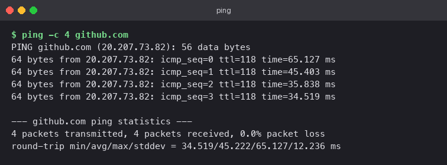
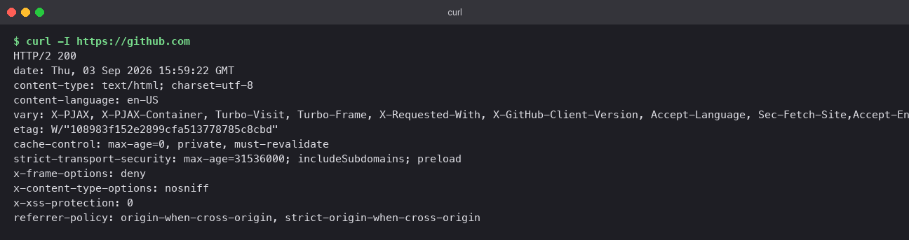
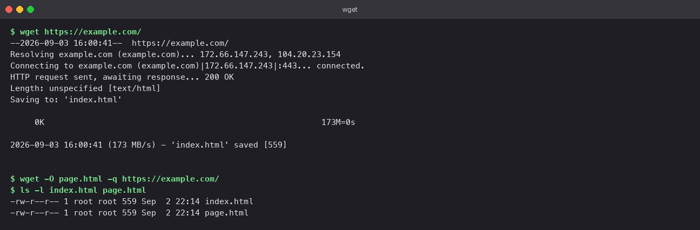
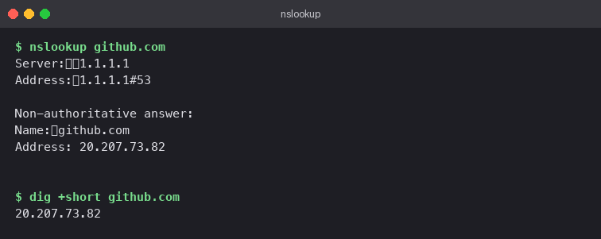
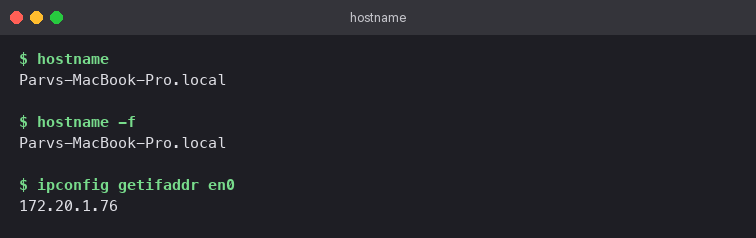

# Networking Fundamentals

## At a glance

Nine commands that together form a debugging toolkit. Each answers one question about a
network problem. Learn the question each one answers and you can work through "the site is
down" methodically instead of guessing.

Commands that exist on macOS were run on the laptop. The Linux-only ones (`ip`, `ss`, `wget`)
were run in an `ubuntu:24.04` container:

```bash
docker run -it --rm ubuntu:24.04 bash
apt-get update -qq && apt-get install -y -qq iproute2 iputils-ping wget curl dnsutils traceroute python3
```

## Concepts

### The debugging ladder

When something is unreachable, climb from the bottom:

```
 5. Application   curl -I https://host        does the service answer HTTP?
 4. Transport     ss -tulpn                   is anything listening on the port?
 3. Name          dig +short host             does the name resolve?
 2. Routing       ip route / traceroute       is there a path, and where does it stop?
 1. Link          ip a / ping gateway         does this machine have an address at all?
```

Each rung uses one of the commands below. Failing at rung 3 with rung 2 working means DNS,
not connectivity.

### Command map

| Question | Command | Replaces |
|---|---|---|
| Is the host up, and how far away is it? | `ping` | |
| What addresses does this machine have? | `ip a` | `ifconfig` |
| Where do packets go? | `ip route` | `route`, `netstat -r` |
| Which ports are open, and by whom? | `ss` | `netstat` |
| What does the HTTP service say? | `curl` | |
| Save a file from a URL | `wget` | |
| What does the name resolve to? | `nslookup`, `dig` | |
| Which hop is slow or broken? | `traceroute` | |
| Who am I on the network? | `hostname` | |

## Lab

### 1. `ping`: reachability and latency

```bash
ping -c 4 github.com
```

Four ICMP echo requests. The first line shows the resolved address, then one line per reply
with the round-trip time, then a summary with packet loss and min/avg/max latency.

**Read it as:** 0% loss means the host answers. Average RTT is your baseline latency. Rising
times across the four replies suggest congestion.

**Caveat:** many hosts and firewalls drop ICMP. No reply is not proof the host is down; try
`curl` on a known port before concluding anything.



### 2. `ip a`: interfaces and addresses

```bash
ip a
ip -br a          # brief: one line per interface
```

Every interface with its state (`UP`/`DOWN`), MAC address, and IPv4/IPv6 addresses. Inside
the container the two that matter are `lo` (127.0.0.1) and `eth0` (something like
`172.17.0.3/16`, on the Docker bridge). The `/16` is the netmask in CIDR notation. Entries such
as `tunl0`, `gre0`, and `sit0` are kernel tunnel devices that are present but `DOWN`; ignore them.


### 3. `ip route`: the routing table

```bash
ip route
ip route get 1.1.1.1
```

The table has a `default via 172.17.0.1` line (the gateway for anything not matched by a more
specific route) and a directly connected route for the local subnet. `ip route get` asks the
kernel which route a specific destination would take, which is the fastest way to confirm
"this traffic leaves via that interface".

**If the default route is missing,** nothing outside the local subnet is reachable, but local
pings still work. That pattern is the giveaway.


### 4. `ss`: sockets and listening ports

```bash
python3 -m http.server 8000 &     # something to look at
ss -tulpn
ss -s
```

| Flag | Meaning |
|---|---|
| `-t` / `-u` | TCP / UDP |
| `-l` | listening sockets only |
| `-p` | show the owning process |
| `-n` | numeric ports, no service-name lookup |

The output shows `python3` listening on `0.0.0.0:8000` with its PID. `ss -s` prints socket
totals. This is the first command to run when a service fails with "address already in use".


### 5. `curl`: speak HTTP from the terminal

```bash
curl -I https://github.com
```

`-I` sends a HEAD request and prints headers only. The status line (`HTTP/2 200`) confirms the
service answered. The headers reveal the server, cache policy, cookies, and security settings
such as `strict-transport-security`.

Forms worth memorising:

```bash
curl -s  URL                 # silent, body only
curl -o file URL             # save body to a file
curl -v  URL                 # verbose: DNS, TCP, TLS handshake, headers both ways
curl -X POST -H "Content-Type: application/json" -d '{"a":1}' URL
curl -w "%{http_code} %{time_total}\n" -o /dev/null -s URL   # just status and timing
```



### 6. `wget`: download a file

```bash
wget https://example.com/
wget -q -O page.html https://example.com/
```

`wget` resolves the host, connects on 443, reports `200 OK`, and saves the body (`index.html`,
559 bytes). `-O` names the output and `-q` silences progress.

**curl or wget?** `curl` writes to stdout and is built for talking to APIs. `wget` writes to
disk and is built for downloading, with resume (`-c`) and recursive mirroring (`-r`). For one
file, either works.



### 7. `nslookup` and `dig`: DNS

```bash
nslookup github.com
dig +short github.com
dig github.com          # full answer with TTLs and the resolver used
```

`nslookup` shows which resolver answered and the A record it returned. `dig +short` prints just
the answer, which is what you want in scripts. Without `+short`, `dig` shows the query, answer,
and authority sections plus the TTL, which tells you how long the record will be cached.

**The classic diagnosis:** `ping 1.1.1.1` works but `ping github.com` says "unknown host".
That is DNS, not the network.



### 8. `traceroute`: the path, hop by hop

```bash
traceroute -m 15 -w 2 github.com
```

Probes are sent with TTL 1, 2, 3, and so on. Each router that decrements the TTL to zero replies,
so you get one line per hop with three timings. `* * *` means that hop does not answer probes,
which is normal on the public internet. `-m 15` caps the hop count and `-w 2` shortens the wait.

**Use it to locate latency,** not just to confirm it. A jump from 5 ms to 150 ms between two
hops shows you where the slow link is.


### 9. `hostname`: identity

```bash
hostname                   # short name
hostname -f                # fully qualified
hostname -I                # Linux: all IPv4 addresses on one line
ipconfig getifaddr en0     # macOS equivalent for the active interface
```



## Pitfalls

- Trusting a failed `ping`. ICMP is often blocked; check the actual port with `curl` or `nc -zv host port`.
- Reading `ss` without `-n`. Service-name lookups are slow and hide the port numbers you know.
- Forgetting that `0.0.0.0:8000` and `127.0.0.1:8000` are different. The first accepts
  connections from anywhere, the second only from the same machine. Containers that bind to
  `127.0.0.1` are unreachable through `-p` port mappings.
- Testing DNS with a browser. Browsers cache aggressively. Use `dig` to see what the resolver
  actually returns right now.
- On Docker Desktop for macOS, "the host" seen by a container is the Linux VM, not the Mac.
  Use `host.docker.internal` to reach services running on the Mac itself.

## Check yourself

1. `ping 8.8.8.8` works but `curl https://example.com` fails. Which two commands do you run
   next, and in what order?
2. What does `/16` after an IP address mean, and how many hosts can that subnet hold?
3. A service says "port 8080 already in use". Show the exact `ss` command that finds the culprit.
4. Why does `curl -I` return faster than `curl -s -o /dev/null`?
5. What does a `* * *` line in `traceroute` output mean, and why is it not necessarily a problem?
