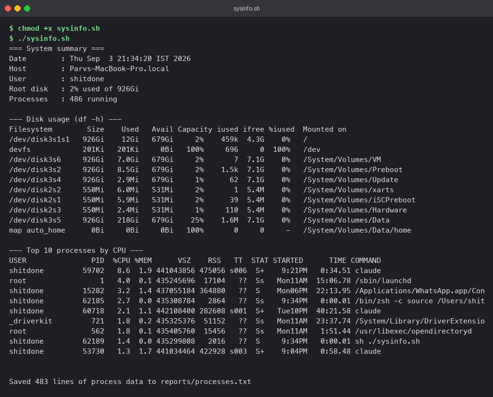

# Shell Scripting

## At a glance

`sysinfo.sh` is a small Bash script that does one useful thing end to end: it summarises the
machine it runs on, asks where to store a report, creates that location, and redirects the full
process list into the file. Along the way it exercises the pieces every real script needs:
variables, command substitution, user input with defaults, directory and file creation, output
redirection, option parsing, and exit codes.

## Concepts

| Building block | What it does | Where the script uses it |
|---|---|---|
| `#!/usr/bin/env bash` | Tells the kernel which interpreter runs the file | Line 1 |
| `set -u` | Abort on an unset variable, which catches typos | Top of the script |
| `name=$(cmd)` | Run a command and store its output | `today`, `box`, `me`, `disk`, `proc_count` |
| `read -r -p "..." var` | Prompt the user and store the answer | Two prompts for the report location |
| `${var:-default}` | Use a default when the variable is empty | Report directory and file name |
| `mkdir -p` | Create a directory tree, no error if it exists | Report directory |
| `touch` | Create an empty file or update its timestamp | Report file |
| `>` and `>>` | Overwrite or append stdout to a file | Writing the process list |
| `getopts` | Parse short options like `-a` and `-h` | Append mode and help |
| `exit N` | Return a status the caller can check | 0, 1, 2 |

### Why quote every expansion

`mkdir -p $report_dir` breaks the moment someone types `my reports`: Bash splits it into two
arguments and creates two directories. `mkdir -p "$report_dir"` keeps it as one. The habit is
simple: **quote every `$variable` unless you specifically want word splitting.**

### `>` vs `>>`

```
ps aux >  report.txt    # truncate the file, then write
ps aux >> report.txt    # keep what is there, write at the end
```

The script defaults to `>` so each run is a clean snapshot. Pass `-a` to switch to `>>`, which
is how you would build up a log over several runs.

## The script

```bash
#!/usr/bin/env bash
set -u

# ---- options ----
append=false
while getopts ":ah" opt; do
  case "$opt" in
    a) append=true ;;
    h) sed -n '2,10p' "$0" | sed 's/^# \{0,1\}//'; exit 0 ;;
    *) echo "unknown option: -$OPTARG (try -h)" >&2; exit 1 ;;
  esac
done

# ---- gather facts into variables ----
today=$(date "+%Y-%m-%d %H:%M:%S")
box=$(hostname)
me=$(whoami)
disk=$(df -h / | awk 'NR==2 {print $5 " used of " $2}')
proc_count=$(ps aux | awk 'NR>1' | wc -l | tr -d ' ')

# ---- print the summary ----
echo "=== System summary ==="
printf '%-12s: %s\n' "Date"      "$today"
printf '%-12s: %s\n' "Host"      "$box"
printf '%-12s: %s\n' "User"      "$me"
printf '%-12s: %s\n' "Root disk" "$disk"
printf '%-12s: %s\n' "Processes" "$proc_count running"

df -h
ps aux | sort -rk 3 | head -n 10 | cut -c1-110

# ---- ask where to put the report, with defaults ----
read -r -p "Directory to save the report in [reports]: " report_dir
read -r -p "Report file name [processes-<timestamp>.txt]: " report_file
report_dir=${report_dir:-reports}
report_file=${report_file:-processes-$(date +%Y%m%d-%H%M%S).txt}
report_path="$report_dir/$report_file"

# ---- create the directory and file ----
mkdir -p "$report_dir" || { echo "could not create directory: $report_dir" >&2; exit 2; }
touch "$report_path"   || { echo "could not create file: $report_path" >&2;    exit 2; }

# ---- redirect the process list into the file ----
{ echo "# process snapshot from $box at $today"; ps aux; } |
  if $append; then cat >> "$report_path"; else cat > "$report_path"; fi

echo "Saved $(wc -l < "$report_path" | tr -d ' ') lines to $report_path"
```

The version in the repository has a few extra lines (uptime, a usage comment block) but the
structure is identical. Read it top to bottom once; every section is labelled.

### Line-by-line notes

- **`awk 'NR==2 {print $5 " used of " $2}'`** picks the second line of `df -h /` (the first
  is the header) and prints the "Use%" and "Size" columns. `awk` is the quickest way to grab
  columns from tabular output.
- **`ps aux | awk 'NR>1' | wc -l`** counts processes without counting the header row.
- **`sort -rk 3`** sorts on column 3 of `ps aux`, which is `%CPU`, in reverse. `head -n 10`
  keeps the top ten and `cut -c1-110` stops long command lines from wrapping on screen. The
  report file gets the untrimmed list.
- **`read -r`** stops Bash from treating backslashes in the input specially. Always use it.
- **`${report_dir:-reports}`** means "if `report_dir` is empty, use `reports`". Pressing
  Enter at both prompts therefore just works.
- **`{ ...; } | if ...`** groups two commands so their combined output goes through one
  redirection. The `if` picks `>>` or `>` based on the flag.
- **`>&2`** sends error messages to stderr, so they still show even when stdout is
  redirected elsewhere.

## Lab

```bash
cd "Shell Scripting"
chmod +x sysinfo.sh

./sysinfo.sh                 # answer the two prompts, or press Enter for defaults
ls -l reports/
head -n 5 reports/*.txt
wc -l reports/*.txt

./sysinfo.sh -a              # run again in append mode and watch the line count grow
./sysinfo.sh -h              # usage text
./sysinfo.sh -x; echo "exit=$?"   # bad flag: prints an error and exits 1
```

**What you should see**

The summary block, disk table, and the ten busiest processes:



The report on disk, checked with `ls`, `head`, and `wc -l`:


`reports/` is a run-time artefact and is listed in `.gitignore`.

## Pitfalls

- **Missing shebang.** Without the first line, the script runs in whatever shell the caller
  is using. `read -p` and `[[ ]]` do not exist in plain `sh`.
- **Windows line endings.** A script edited on Windows may carry `\r` characters and fail
  with `bad interpreter: /bin/bash^M`. Fix with `sed -i 's/\r$//' script.sh`.
- **Unquoted variables** split on spaces and expand globs. See above.
- **Checking `$?` too late.** `$?` holds the status of the *last* command. Test it
  immediately, or use `cmd || handle_error` as the script does.
- **`set -e` with pipelines.** `set -e` only sees the last command in a pipeline. Add
  `set -o pipefail` if a failing `ps` or `sort` should stop the script.

## Check yourself

1. What is the difference between `$(cmd)` and `"$(cmd)"` when the output contains spaces?
2. Why does the script send error messages with `>&2` instead of plain `echo`?
3. What happens if you run `./sysinfo.sh` and press Enter at both prompts?
4. How would you make the script exit non-zero when `df` fails, given it runs inside `$(...)`?
5. Rewrite the top-ten section to sort by memory instead of CPU. Which column is that?
